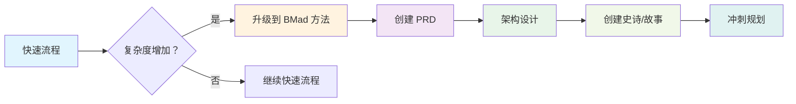

# BMAD 快速流程

**路径：** 快速流程
**主要代理：** 快速流程独立开发者 (Barry)
**适用场景：** Bug 修复、小型功能、快速原型

---

## 概述

BMAD 快速流程是 BMAD 方法生态系统中从想法到生产环境的最快路径。这是一个精简的 3 步流程，专为快速规格驱动开发而设计，不牺牲质量。非常适合需要快速移动的经验丰富的团队，或者不需要大量规划的小型功能或一次性任务。

### 何时使用快速流程

**非常适合：**

- Bug 修复和补丁
- 小型功能添加
- 概念验证和原型
- 中途纠正或补充 BMAD 完整规划中遗漏的内容
- 性能优化
- API 端点添加
- UI 组件增强
- 配置更改
- 内部工具

**不推荐用于：**

- 大规模系统重新设计
- 复杂的多团队项目
- 新产品发布
- 需要大量 UX 设计的项目
- 企业级计划
- 具有合规要求的关键任务系统
- 有许多"动态部件"的想法

---

## 快速流程

利用快速流程独立开发者，这一个代理可以完成一切！

1. 创建（可选）技术规格
2. 开发并测试
3. AI 驱动的代码审查

就是这样！但让我们更详细地看看每个步骤。

### 步骤 1：可选技术规格

`create-tech-spec` 工作流将需求转化为实施就绪的规格。

**主要特点：**

- 对话式规格工程
- 自动代码库模式检测
- 从现有代码收集上下文
- 实施就绪的任务分解
- 验收标准定义

**流程：**

1. **问题理解**
   - 问候用户并收集需求
   - 询问范围和限制的澄清问题
   - 检查现有项目上下文

2. **代码调查（现有项目）**
   - 分析现有代码库模式
   - 记录技术栈和约定
   - 识别要修改的文件和依赖项

3. **规格生成**
   - 创建结构化技术规格
   - 定义明确的任务和验收标准
   - 记录技术决策
   - 包含开发上下文

4. **审查和最终确定**
   - 展示规格以进行验证
   - 根据需要进行调整
   - 保存到冲刺产物

**输出：** `{implementation_artifacts}/tech-spec-{slug}.md`

### 步骤 2：开发

`quick-dev` 工作流以灵活和速度执行实施。

**两种执行模式：**

**模式 A：技术规格驱动**

```bash
# 从技术规格执行
quick-dev tech-spec-feature-x.md
```

- 加载和解析技术规格
- 提取任务、上下文和验收标准
- 按顺序执行所有任务
- 完成后更新规格状态

**模式 B：直接指令**

```bash
# 直接开发命令
quick-dev "Add password reset to auth service"
quick-dev "Fix the memory leak in image processing"
```

- 接受直接开发指令
- 提供可选规划步骤
- 立即执行，最小化摩擦

**开发过程：**

1. **上下文加载**
   - 加载项目上下文（如果可用）
   - 理解模式和约定
   - 识别相关文件和依赖项

2. **实施循环**
   对于每个任务：
   - 加载相关文件和上下文
   - 按照既定模式实施
   - 编写适当的测试
   - 运行并验证测试通过
   - 标记任务完成并继续

3. **持续执行**
   - 不停顿地完成所有任务
   - 通过请求指导处理失败
   - 确保测试通过后继续

4. **验证**
   - 确认所有任务完成
   - 验证验收标准
   - 如果使用了技术规格，则更新其状态

### 步骤 3：可选代码审查

`code-review` 工作流提供对实施代码的高级开发人员审查。

**何时使用：**

- 生产关键功能
- 安全敏感实施
- 性能优化
- 团队开发场景
- 学习和知识转移

**审查过程：**

1. 加载故事上下文和验收标准
2. 分析代码实施
3. 对照项目模式检查
4. 验证测试覆盖
5. 提供结构化审查笔记
6. 如需要，建议改进

---

## 快速流程 vs 其他路径

| 方面            | 快速流程       | BMad 方法     | 企业方法  |
| ---------------- | ---------------- | --------------- | ------------------ |
| **规划**      | 最小/可选 | 结构化      | 全面      |
| **文档** | 仅必需   | 适中        | 广泛          |
| **团队规模**     | 1-2 名开发人员   | 3-7 名专家 | 8+ 企业团队 |
| **时间线**      | 数小时到数天    | 数周到数月 | 数月到数季度 |
| **仪式**      | 最小          | 平衡        | 完整治理    |
| **灵活性**   | 高             | 适中        | 结构化         |
| **风险概况**  | 中等           | 低             | 非常低         |

---

## 最佳实践

### 开始快速流程之前

1. **验证路径选择**
   - 功能是否足够小？
   - 你有明确的需求吗？
   - 团队对快速开发感到舒适吗？

2. **准备上下文**
   - 准备好项目文档
   - 了解你的代码库模式
   - 预先识别受影响的组件

3. **设定明确边界**
   - 定义范围内和范围外的项目
   - 建立验收标准
   - 识别依赖项

### 开发期间

1. **保持速度**
   - 不要过度设计解决方案
   - 遵循现有模式
   - 保持测试与风险成比例

2. **保持专注**
   - 抵制范围蔓延
   - 如果可能，稍后处理边缘情况
   - 简要记录决策

3. **沟通进度**
   - 定期更新任务状态
   - 立即标记阻塞因素
   - 与团队分享学习

### 完成后

1. **质量门控**
   - 确保测试通过
   - 验证验收标准
   - 考虑可选代码审查

2. **知识转移**
   - 更新相关文档
   - 分享关键决策
   - 记录发现的任何模式

3. **生产就绪**
   - 验证部署要求
   - 检查监控需求
   - 规划回滚策略

---

## 快速流程模板

### 技术规格模板

```markdown
# 技术规格：{功能标题}

**创建：** {日期}
**状态：** 准备开发
**预估工作量：** 小型（1-2 天）

## 概述

### 问题陈述

{需要解决问题的清晰描述}

### 解决方案

{解决问题的高层方法}

### 范围（内/外）

**内：** {将实施的内容}
**外：** {明确排除的项目}

## 开发上下文

### 代码库模式

{要遵循的关键模式、约定}

### 要参考的文件

{相关文件及其用途列表}

### 技术决策

{重要技术选择和基本原理}

## 实施计划

### 任务

- [ ] 任务 1：{具体实施任务}
- [ ] 任务 2：{具体实施任务}
- [ ] 任务 3：{测试和验证}

### 验收标准

- [ ] AC 1：{给定/当/则格式}
- [ ] AC 2：{给定/当/则格式}

## 附加上下文

### 依赖项

{外部依赖项或先决条件}

### 测试策略

{如何测试功能}

### 注意事项

{其他考虑事项}
```

### 快速开发命令

```bash
# 从技术规格
quick-dev sprint-artifacts/tech-spec-user-auth.md

# 直接开发
quick-dev "Add CORS middleware to API endpoints"
quick-dev "Fix null pointer exception in user service"
quick-dev "Optimize database query for user list"

# 带可选规划
quick-dev "Implement file upload feature" --plan
```

---

## 与其他工作流集成

### 升级路径

如果快速流程功能的复杂度增加：



### 使用派对模式

对于复杂的快速流程挑战：

```bash
# 启动 Barry
/bmad:bmm:agents:quick-flow-solo-dev

# 开始派对模式进行协作问题解决
party-mode
```

派对模式引入相关专家：

- **架构师** - 设计决策
- **开发人员** - 实施结对
- **QA** - 测试策略
- **UX 设计师** - 用户体验
- **分析师** - 需求清晰度

### 质量保证集成

快速流程可以与 TEA 代理集成进行自动化测试：

- 测试用例生成
- 自动化测试执行
- 覆盖分析
- 测试修复

---

## 常见快速流程场景

### 场景 1：Bug 修复

```
需求："用户无法重置密码"
流程：直接开发（无需规格）
步骤：调查 → 修复 → 测试 → 部署
时间：2-4 小时
```

### 场景 2：小型功能

```
需求："添加导出到 CSV 功能"
流程：技术规格 → 开发 → 代码审查
步骤：规格 → 实施 → 测试 → 审查 → 部署
时间：1-2 天
```

### 场景 3：性能修复

```
需求："优化缓慢的产品搜索查询"
流程：技术规格 → 开发 → 审查
步骤：分析 → 优化 → 基准测试 → 部署
时间：1 天
```

### 场景 4：API 添加

```
需求："为集成添加 webhook 端点"
流程：技术规格 → 开发 → 审查
步骤：设计 → 实施 → 文档 → 部署
时间：2-3 天
```

---

## 指标和 KPI

跟踪这些指标以确保快速流程有效性：

**速度指标：**

- 每周完成的功能
- 平均周期时间（小时）
- Bug 修复解决时间
- 代码审查周转

**质量指标：**

- 缺陷逃逸率
- 测试覆盖率百分比
- 生产事件率
- 代码审查发现

**团队指标：**

- 开发人员满意度
- 知识共享频率
- 流程遵守
- 自主指数

---

## 快速流程故障排除

### 常见问题

**问题：开发期间范围蔓延**
**解决方案：** 回顾技术规格，明确记录新需求

**问题：未知模式或约定**
**解决方案：** 使用派对模式引入架构师或高级开发人员

**问题：测试瓶颈**
**解决方案：** 利用 TEA 代理进行自动化测试生成

**问题：集成冲突**
**解决方案：** 记录依赖项，与受影响的团队协调

### 紧急程序

**生产热修复：**

1. 从生产环境创建分支
2. 快速开发，最小化更改
3. 部署到暂存环境
4. 快速回归测试
5. 部署到生产环境
6. 合并到主分支

**关键 Bug：**

1. 立即调查
2. 如果不清楚，使用派对模式
3. 快速修复并制定回滚计划
4. 事后分析文档

---

## 相关文档

- **[快速流程独立开发代理](./quick-flow-solo-dev.md)** - 快速流程的主要代理
- **[代理指南](./agents-guide.md)** - 完整代理参考
- **[可扩展自适应系统](./scale-adaptive-system.md)** - 路径选择指导
- **[派对模式](./party-mode.md)** - 多代理协作
- **[工作流实施](./workflows-implementation.md)** - 实施细节

---

## FAQ

**问：如何知道我的功能对于快速流程来说太大了？**
答：如果需要超过 3-5 天的工作量，显著影响多个系统，或需要大量 UX 设计，请考虑 BMad 方法路径。

**问：我可以在开发中途从快速流程切换到 BMad 方法吗？**
答：可以，你可以升级。创建缺失的产物（PRD、架构）并过渡到基于冲刺的开发。

**问：快速流程适合生产关键功能吗？**
答：适合，但需要代码审查。快速流程不牺牲质量，只是减少仪式。

**问：如何处理快速流程功能之间的依赖关系？**
答：清晰记录依赖项，考虑批量处理相关功能，或升级到 BMad 方法处理复杂的相互依赖关系。

**问：初级开发人员可以使用快速流程吗？**
答：可以，但他们可能从 BMad 方法的结构中受益。快速流程假设对模式和自主性很熟悉。

---

**准备快速交付？** → 从 `/bmad:bmm:agents:quick-flow-solo-dev` 开始
