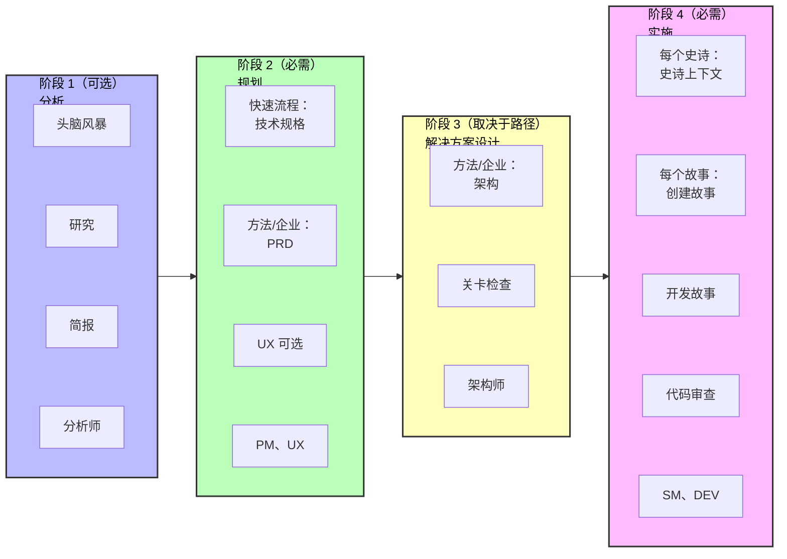

# BMad 方法 V6 快速开始指南

通过 AI 驱动的工作流，使用 BMad 方法 v6 从零开始构建软件。本指南将带你完成整个构建过程。

## 一图以蔽之 - 快速路径

1. **安装**: `npx bmad-method@alpha install`
2. **初始化**: 加载分析师代理 → 运行 "workflow-init"
3. **规划**: 加载 PM 代理创建产品需求文档 (PRD)
4. **规划用户体验**: 如果你的应用包含 UI/UX 元素，加载 UX 专家来创建 UX 设计文档
5. **架构设计**: 加载架构师代理 → 运行 "create-architecture"
6. **史诗规划**: PM 再次介入帮助运行 create-epics-and-stories
7. **构建**: 加载 SM 代理 → 为每个故事运行工作流 → 加载 DEV 代理 → 实施
8. **始终使用新的对话** 进行每个工作流，避免上下文问题

## 什么是 BMad 方法？

BMad 方法 (BMM) 通过引导式工作流和专业化 AI 代理帮助你构建软件。整个流程分为四个阶段：

1. **阶段 1：分析**（可选）- 头脑风暴、研究、产品简报
2. **阶段 2：规划**（必需）- 创建你的需求文档（技术规格或 PRD）
3. **阶段 3：解决方案设计**（取决于项目类型）- 为 BMad 方法和企业级路径设计架构
4. **阶段 4：实施**（必需）- 逐个史诗、逐个故事地构建软件

### 完整工作流可视化


_BMad 方法标准新建项目路径的完整可视化流程图，展示所有阶段、工作流、代理（按颜色编码）和决策点。每个框都由负责该工作流的代理用颜色编码。_

## 安装

```bash
# 将 v6 Alpha 版本安装到你的项目
npx bmad-method@alpha install
```

交互式安装程序将引导你完成设置，并创建一个包含所有代理和工作流的 `_bmad/` 文件夹。

---

## 入门指南

### 步骤 1：初始化你的工作流

1. 在你的 IDE 中**加载分析师代理** - 查看特定 IDE 的说明 [docs/ide-info](https://github.com/bmad-code-org/BMAD-METHOD/tree/main/docs/ide-info) 了解如何激活代理：
   - [Claude Code](https://github.com/bmad-code-org/BMAD-METHOD/blob/main/docs/ide-info/claude-code.md)
   - [VS Code/Cursor/Windsurf](https://github.com/bmad-code-org/BMAD-METHOD/tree/main/docs/ide-info) - 查看你的 IDE 文件夹
   - 其他 IDE 也支持
2. **等待代理菜单**出现
3. **告诉代理**："Run workflow-init" 或输入 "*workflow-init" 或选择菜单项编号

#### workflow-init 期间会发生什么？

在 V6 中，工作流是替代以前版本的任务和模板的交互式过程。工作流有很多种类型，你甚至可以使用 BMad Builder 模块创建自己的工作流。对于 BMad 方法，你将与专家设计的工作流交互，这些工作流旨在与你协作，让你和 LLM 发挥最佳效果。

在 workflow-init 期间，你需要描述：

- 你的项目及其目标
- 是否有现有代码库，还是这是一个新项目
- 总体规模和复杂度（你可以稍后调整）

#### 规划路径

根据你的描述，工作流将建议一个路径，让你选择：

**三种规划路径：**

- **快速流程** - 快速实施（仅需技术规格）- Bug 修复、简单功能、范围清晰（通常 1-15 个故事）
- **BMad 方法** - 完整规划（PRD + 架构 + UX）- 产品、平台、复杂功能（通常 10-50+ 个故事）
- **企业方法** - 扩展规划（BMad 方法 + 安全/DevOps/测试）- 企业需求、合规、多租户（通常 30+ 个故事）

**注意**：故事计数仅供参考，不是定义。路径是根据规划需求选择的，而不是故事数量计算。

#### 会创建什么？

确认路径后，`bmm-workflow-status.yaml` 文件将在你项目的 docs 文件夹中创建（假设默认安装位置）。该文件跟踪你在所有阶段的进度。

**重要说明：**

- 每个路径在各个阶段有不同的路径
- 故事数量仍可能根据你工作时的整体复杂度而变化
- 对于本指南，我们假设使用 BMad 方法路径项目
- 此工作流将引导你完成阶段 1（可选）、阶段 2（必需）和阶段 3（BMad 方法和企业路径必需）

### 步骤 2：完成阶段 1-3

workflow-init 完成后，你将完成规划阶段。**重要：为每个工作流使用新的对话以避免上下文限制。**

#### 检查你的状态

如果你不确定下一步该做什么：

1. 在新对话中加载任何代理
2. 询问 "workflow-status"
3. 代理将告诉你下一个推荐或必需的工作流

**示例响应：**

```
阶段 1（分析）完全可选。所有工作流都是可选或推荐的：
  - brainstorm-project - 可选
  - research - 可选
  - product-brief - 推荐（但不是必需）

下一个真正必需的步骤是：
  - 阶段 2 规划中的 PRD（产品需求文档）
  - 代理：pm
  - 命令：prd
```

#### 如何在阶段 1-3 中运行工作流

当代理告诉你运行工作流时（如 `prd`）：

1. **用指定的代理（如 PM）开始新对话** - 查看 [docs/ide-info](https://github.com/bmad-code-org/BMAD-METHOD/tree/main/docs/ide-info) 了解你的 IDE 的具体说明
2. **等待菜单**出现
3. 使用以下任何一种格式**告诉代理运行它**：
   - 输入简写：`*prd`
   - 自然表达："让我们创建新的 PRD"
   - 选择 "create-prd" 的菜单编号

V6 中的代理非常擅长模糊菜单匹配！

#### 快速参考：代理 → 文档映射

对于 v4 用户或那些希望跳过 workflow-status 指导的用户：

- **分析师** → 头脑风暴、产品简报
- **PM** → PRD（BMad 方法/企业路径）或 技术规格（快速流程路径）
- **UX 设计师** → UX 设计文档（如果项目包含 UI 部分）
- **架构师** → 架构（BMad 方法/企业路径）

#### 阶段 2：规划 - 创建 PRD

**对于 BMad 方法和企业路径：**

1. 在新对话中加载 **PM 代理**
2. 告诉它运行 PRD 工作流
3. 完成后，你将拥有：
   - **PRD.md** - 你的产品需求文档

**对于快速流程路径：**

- 使用 **技术规格** 代替 PRD（不需要架构）

#### 阶段 2（可选）：UX 设计

如果你的项目有用户界面：

1. 在新对话中加载 **UX 设计师代理**
2. 告诉它运行 UX 设计工作流
3. 完成后，你将拥有你的 UX 规格文档

#### 阶段 3：架构设计

**对于 BMad 方法和企业路径：**

1. 在新对话中加载 **架构师代理**
2. 告诉它运行 create-architecture 工作流
3. 完成后，你将拥有包含技术决策的架构文档

#### 阶段 3：创建史诗和故事（架构后必需）

**V6 改进：** 史诗和故事现在在架构之后创建，以提高质量！

1. 在新对话中加载 **PM 代理**
2. 告诉它运行 "create-epics-and-stories"
3. 这会将你的 PRD 中的功能需求/非功能需求分解为可实施的史诗和故事
4. 工作流同时使用 PRD 和架构来创建具有技术意识的故事

**为什么在架构之后？** 架构决策（数据库、API 模式、技术栈）直接影响故事应该分解和排序的方式。

#### 阶段 3：实施就绪检查（强烈推荐）

创建史诗和故事后：

1. 在新对话中加载 **架构师代理**
2. 告诉它运行 "implementation-readiness"
3. 这将验证所有规划文档（PRD、UX、架构、史诗）之间的一致性
4. 这在 v4 中被称为 "PO 主检查清单"

**为什么要运行这个？** 它确保所有规划资产在开始构建之前正确对齐。

#### 上下文管理提示

- **使用 200k+ 上下文模型** 以获得最佳效果（Claude Sonnet 4.5、GPT-4 等）
- **每个工作流使用新对话** - 头脑风暴、简报、研究和 PRD 生成都都是上下文密集的
- **不需要文档分片** - 与 v4 不同，你不需要分割文档
- **Web 包即将推出** - 将帮助有限的计划用户节省 LLM 令牌

### 步骤 3：开始构建（阶段 4 - 实施）

规划和架构完成后，你将进入阶段 4。**重要：下面的每个工作流都应该在新对话中运行，以避免上下文限制和幻觉。**

#### 3.1 初始化冲刺规划

1. **开始新对话**，使用 **SM（Scrum Master）代理**
2. 等待菜单出现
3. 告诉代理："Run sprint-planning"
4. 这将创建你的 `sprint-status.yaml` 文件，跟踪所有史诗和故事

#### 3.2 创建你的第一个故事

1. **开始新对话**，使用 **SM 代理**
2. 等待菜单
3. 告诉代理："Run create-story"
4. 这将从史诗创建故事文件

#### 3.3 实施故事

1. **开始新对话**，使用 **DEV 代理**
2. 等待菜单
3. 告诉代理："Run dev-story"
4. DEV 代理将实施故事并更新冲刺状态

#### 3.4 审查代码（可选但推荐）

1. **开始新对话**，使用 **DEV 代理**
2. 等待菜单
3. 告诉代理："Run code-review"
4. DEV 代理执行质量验证（这在 v4 中被称为 QA）

### 步骤 4：继续前进

对于每个后续故事，为每个工作流使用**新对话**重复循环：

1. **新对话** → SM 代理 → "Run create-story"
2. **新对话** → DEV 代理 → "Run dev-story"
3. **新对话** → DEV 代理 → "Run code-review"（可选但推荐）

完成史诗中的所有故事后：

1. **开始新对话**，使用 **SM 代理**
2. 告诉代理："Run retrospective"

**为什么要新对话？** 如果你在同一对话中继续发出命令，上下文密集的工作流可能会导致幻觉。重新开始确保代理为每个工作流拥有最大的上下文容量。

---

## 理解代理

每个代理都是一个专业的 AI 角色：

- **分析师** - 初始化工作流并跟踪进度
- **PM** - 创建需求和规格
- **UX 设计师** - 如果你的项目有前端 - 这个设计师将帮助制作产品、提出模型更新，并在你的指导下设计出色的外观和感觉
- **架构师** - 设计系统架构
- **SM（Scrum Master）** - 管理冲刺并创建故事
- **DEV** - 实施代码并审查工作

## 工作流如何工作

1. **加载代理** - 在你的 IDE 中打开代理文件以激活它
2. **等待菜单** - 代理将展示其可用的工作流
3. **告诉代理要运行什么** - 说 "运行 [工作流名称]"
4. **遵循提示** - 代理将引导你完成每个步骤

代理在整个过程中创建文档、提出问题并帮助你做出决策。

## 项目跟踪文件

BMad 创建两个文件来跟踪你的进度：

**1. bmm-workflow-status.yaml**

- 显示你处于哪个阶段以及接下来是什么
- 由 workflow-init 创建
- 在你完成各个阶段时自动更新

**2. sprint-status.yaml**（仅阶段 4）

- 在实施期间跟踪所有史诗和故事
- 对于 SM 和 DEV 代理知道接下来要做什么至关重要
- 由 sprint-planning 工作流创建
- 随着故事进展自动更新

**你不需要手动编辑这些** - 代理会在你工作时更新它们。

---

## 完整流程可视化



## 常见问题

**问：我总是需要架构吗？**
答：仅对于 BMad 方法和企业路径。快速流程项目直接从技术规格跳到实施。

**问：我可以稍后更改计划吗？**
答：可以！SM 代理有一个 "correct-course" 工作流用于处理范围变更。

**问：如果我想先进行头脑风暴怎么办？**
答：在运行 workflow-init 之前加载分析师代理并告诉它 "运行 brainstorm-project"。

**问：为什么每个工作流都需要新对话？**
答：如果顺序运行，上下文密集的工作流可能会导致幻觉。新对话确保最大的上下文容量。

**问：我可以跳过 workflow-init 和 workflow-status 吗？**
答：可以，一旦你了解了流程。使用步骤 2 中的快速参考直接转到你需要的工作流。

## 获取帮助

- **工作流期间**：代理通过问题和解释指导你
- **社区**：[Discord](https://discord.gg/gk8jAdXWmj) - #general-dev、#bugs-issues
- **完整指南**：[BMM 工作流文档](./index.md#-workflow-guides)
- **YouTube 教程**：[BMad 代码频道](https://www.youtube.com/@BMadCode)

---

## 关键要点

✅ **始终使用新对话** - 为每个工作流在新对话中加载代理以避免上下文问题
✅ **让 workflow-status 指导你** - 不确定下一步时加载任何代理并询问状态
✅ **路径很重要** - 快速流程使用技术规格，BMad 方法/企业需要 PRD 和架构
✅ **跟踪是自动的** - 状态文件会自动更新，无需手动编辑
✅ **代理很灵活** - 使用菜单编号、快捷键（*prd）或自然语言

**准备开始构建了吗？** 安装 BMad，加载分析师，运行 workflow-init，让代理引导你！
