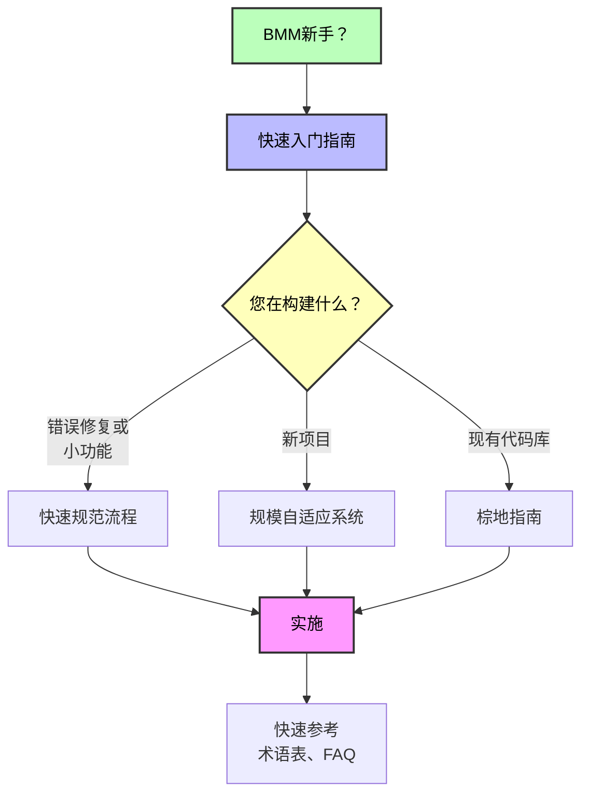

# BMM 文档

BMad方法模块（BMM）的完整指南 - 适应您项目复杂性的AI驱动敏捷开发工作流。

---

## 🚀 快速入门

**BMM新手？** 从这里开始：

- **[快速入门指南](./quick-start_zh.md)** - 构建您的第一个项目的分步指南（15分钟阅读）
  - 安装和设置
  - 理解四个阶段
  - 运行您的第一个工作流
  - 基于代理的开发流程

**快速路径：** 安装 → workflow-init → 遵循代理指导

---

## 📖 核心概念

理解BMM如何适应您的需求：

- **[规模自适应系统](./scale-adaptive-system_zh.md)** - BMM如何适应项目规模和复杂性（42分钟阅读）
  - 三个规划轨道（快速流程、BMad方法、企业方法）
  - 自动轨道推荐
  - 每个轨道的文档需求
  - 规划工作流路由

- **[快速规范流程](./quick-spec-flow_zh.md)** - 快速流程轨道的快速通道工作流（26分钟阅读）
  - 错误修复和小功能
  - 快速原型方法
  - 自动检测堆栈和模式
  - 分钟级实施

---

## 🤖 代理和协作

BMM的AI代理团队的完整指南：

- **[代理指南](./agents-guide_zh.md)** - 综合代理参考（45分钟阅读）
  - 12个专业BMM代理 + BMad主控
  - 代理角色、工作流和何时使用它们
  - 代理定制系统
  - 最佳实践和常见模式

- **[派对模式指南](./party-mode_zh.md)** - 多代理协作（20分钟阅读）
  - 派对模式如何工作（19+个代理实时协作）
  - 何时使用（战略、创意、跨职能、复杂）
  - 示例派对组合
  - 多模块集成（BMM + CIS + BMB + 定制）
  - 派对模式中的代理定制
  - 最佳实践

---

## 🔧 与现有代码协作

棕地开发的综合指南：

- **[棕地开发指南](./brownfield-guide_zh.md)** - 现有代码库的完整指南（53分钟阅读）
  - 文档阶段策略
  - 棕地轨道选择
  - 与现有模式集成
  - 分阶段工作流指导
  - 常见场景

---

## 📚 快速参考

基本参考资料：

- **[术语表](./glossary_zh.md)** - 关键术语和概念
- **[FAQ](./faq_zh.md)** - 所有主题的常见问题
- **[企业代理开发](./enterprise-agentic-development_zh.md)** - 团队协作策略

---

## 🎯 选择您的路径

### 我需要...

**构建新东西（绿地）**
从[快速入门指南](./quick-start_zh.md)开始
然后查看[规模自适应系统](./scale-adaptive-system_zh.md)理解轨道

**修复错误或添加小功能**
直接转到[快速规范流程](./quick-spec-flow_zh.md)

**与现有代码库协作（棕地）**
阅读[棕地开发指南](./brownfield-guide_zh.md)
特别注意阶段0文档需求

**理解规划轨道和方法论**
参见[规模自适应系统](./scale-adaptive-system_zh.md)

**查找特定命令或答案**
检查[FAQ](./faq_zh.md)

---

## 📋 工作流指南

按阶段组织的所有BMM工作流的综合文档：

- **[阶段1：分析工作流](./workflows-analysis.md)** - 可选的探索和研究工作流（595行）
  - brainstorm-project、product-brief、research等
  - 何时使用分析工作流
  - 创意和战略工具

- **[阶段2：规划工作流](./workflows-planning.md)** - 规模自适应规划（967行）
  - prd、tech-spec、gdd、narrative、ux
  - 基于轨道的规划方法（快速流程、BMad方法、企业方法）
  - 使用哪个规划工作流

- **[阶段3：解决方案设计工作流](./workflows-solutioning.md)** - 架构和验证（638行）
  - architecture、solutioning-gate-check
  - BMad方法和企业方法轨道需要
  - 防止代理冲突

- **[阶段4：实施工作流](./workflows-implementation.md)** - 基于冲刺的开发（1,634行）
  - sprint-planning、create-story、dev-story、code-review
  - 完整故事生命周期
  - 一次一个故事的纪律

- **[测试和QA工作流](./test-architecture.md)** - 综合质量保证（1,420行）
  - 测试策略、自动化、质量网关
  - TEA代理和测试修复
  - BMM集成vs独立模式

**总计：所有阶段记录了34个工作流**

### 高级工作流参考

有关特定复杂工作流的详细技术文档：

- **[文档项目工作流参考](./workflow-document-project-reference.md)** - 技术深度探讨（445行）
  - v1.2.0上下文安全架构
  - 扫描级别、可恢复性、边写边记录
  - 多部分项目检测
  - 针对性分析的深入模式

- **[架构工作流参考](./workflow-architecture-reference.md)** - 决策架构指南（320行）
  - 启动模板智能
  - 新颖模式设计
  - 代理一致性的实施模式
  - 自适应促进方法

---

## 🧪 测试和质量

质量保证指导：

<!-- 测试架构师文档待添加 -->

- 测试设计工作流
- 质量网关
- 风险评估
- NFR验证

---

## 🏗️ 模块结构

理解BMM组件：

- **[BMM模块README](../README.md)** - 模块结构概览
  - 代理名单和角色
  - 工作流组织
  - 团队和协作
  - 最佳实践

---

## 🌐 外部资源

### 社区和支持

- **[Discord社区](https://discord.gg/gk8jAdXWmj)** - 从社区获得帮助（#general-dev、#bugs-issues）
- **[GitHub Issues](https://github.com/bmad-code-org/BMAD-METHOD/issues)** - 报告错误或请求功能
- **[YouTube频道](https://www.youtube.com/@BMadCode)** - 视频教程和演练

### 附加文档

- **[IDE设置指南](../../../docs/ide-info/)** - 配置您的开发环境
  - Claude Code
  - Cursor
  - Windsurf
  - VS Code
  - 其他IDE

---

## 📊 文档地图

---

## 💡 使用此文档的技巧

1. **从快速入门开始** 如果您是新手 - 它提供基本基础
2. **使用FAQ** 在不阅读整个指南的情况下找到快速答案
3. **收藏术语表** 在阅读其他文档时作为术语参考
4. **根据您的具体情况遵循上述建议路径**
5. **加入Discord** 获得互动帮助和社区见解

---

**准备好开始了吗？** → [从快速入门指南开始](./quick-start_zh.md)