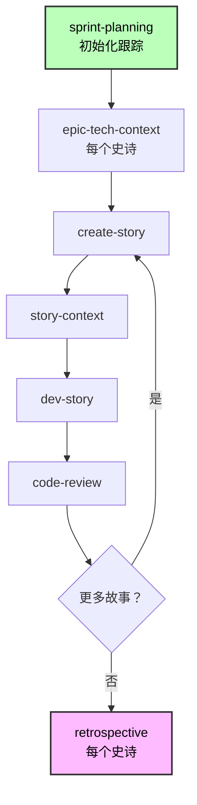
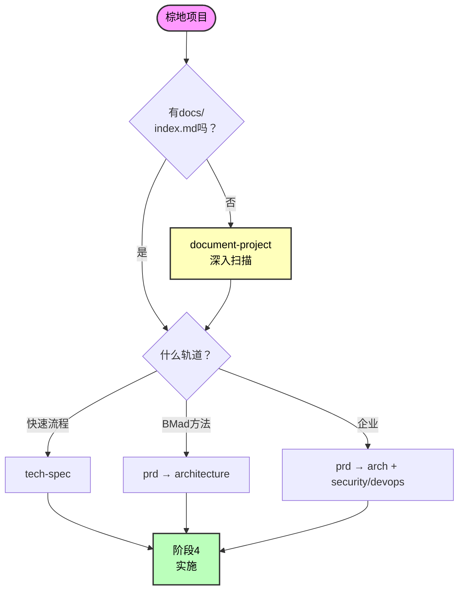

# BMad Method 棕地开发指南

**使用现有代码库的完整指南**

**阅读时间：** 约35分钟

---

## 快速导航

**跳转到：**

- [快速参考](#快速参考) - 命令和文件
- [常见场景](#常见场景) - 真实世界示例
- [最佳实践](#最佳实践) - 成功技巧

---

## 什么是棕地开发？

棕地项目涉及在现有代码库中工作，而不是从头开始：

- **错误修复** - 单文件更改
- **小功能** - 添加到现有模块
- **功能集** - 多个相关功能
- **主要集成** - 复杂的架构添加
- **系统扩展** - 企业级增强

**与绿地的关键区别：** 您必须理解并尊重现有模式、架构和约束。

**核心原则：** AI代理需要全面的文档来理解现有代码，然后才能有效规划或实施更改。

---

## 入门指南

### 理解规划轨道

有关完整的轨道详情，请参见[规模自适应系统](./scale-adaptive-system.md)。

**棕地轨道一览：**

| 轨道                 | 范围                      | 典型故事数 | 关键差异                                  |
| --------------------- | -------------------------- | ------------ | ----------------------------------------- |
| **快速流程**          | 错误修复、小功能          | 1-15         | 必须理解受影响的代码和模式                |
| **BMad方法**          | 功能集、集成              | 10-50+       | 与现有架构集成                            |
| **企业方法**          | 企业扩展                  | 30+          | 需要完整系统文档 + 合规性                 |

**注意：** 故事数量是指导，不是定义。轨道基于规划需求选择。

### 棕地轨道选择

当您运行`workflow-init`时，它会智能处理棕地：

**第1步：显示它发现了什么**

- 旧的规划文档（PRD、史诗、故事）
- 现有代码库

**第2步：询问关于您的工作**

> "这些是进行中的工作、之前的努力还是提议的工作？"

- **(a) 进行中的工作** → 使用工件确定级别
- **(b) 之前的努力** → 要求您描述新工作
- **(c) 提议的工作** → 使用工件作为指导
- **(d) 以上都不是** → 您解释您的工作

**第3步：分析您的描述**

- 关键词："修复"、"错误" → 快速流程，"仪表板"、"平台" → BMad方法，"企业"、"多租户" → 企业方法
- 复杂性评估
- 与您确认建议的轨道

**关键原则：** 系统首先询问关于您当前的工作，仅将旧工件作为上下文使用。

**示例：旧的复杂PRD，新的简单工作**

```
系统："发现 PRD.md（BMad方法轨道，30个故事，6个月前）"
系统："这是进行中的工作还是之前的努力？"
您："之前的努力 - 我现在只是修复一个错误"
系统："告诉我关于您当前的工作"
您："更新支付方法枚举"
系统："快速流程轨道（技术规范方法）。正确吗？"
您："是"
✅ 创建快速流程工作流
```

---

## 阶段0：文档（关键第一步）

🚨 **对于棕地项目：在规划前始终确保足够的AI可用文档**

### 默认建议：运行document-project

**最佳实践：** 除非您有**确认的、可信的、AI优化的文档**，否则运行`document-project`工作流。

### 为什么document-project几乎总是正确选择

现有文档通常有破坏AI工作流的质量问题：

**常见问题：**

- **信息过多（TMI）：** 巨大的markdown文件，包含10个或100个二级标题
- **过时：** 文档未随最近的代码更改更新
- **格式错误：** 为人类编写，不是AI代理（缺乏结构、索引、清晰模式）
- **覆盖不完整：** 缺少关键架构、模式或设置信息
- **质量不一致：** 有些区域记录良好，其他区域完全没有

**对AI代理的影响：**

- AI代理阅读大文件时达到令牌限制
- 过时的文档导致幻觉（代理认为旧模式仍然适用）
- 缺少结构意味着代理无法找到相关信息
- 覆盖不完整导致错误假设

### 文档决策树

**第1步：评估现有文档质量**

问自己：

- ✅ 它是**当前**的吗（最近30天内更新）？
- ✅ 它是**AI优化**的吗（有index.md结构、清晰部分、每文件<500行）？
- ✅ 它是**全面**的吗（架构、模式、设置都已记录）？
- ✅ 您完全**信任**它供AI代理使用吗？

**如果任何答案是否 → 运行`document-project`**

**第2步：检查巨大文档**

如果您有文档但文件巨大（>500行，10+个二级标题）：

1. **首先：** 运行`shard-doc`工具拆分大文件：

   ```bash
   # 加载BMad主控或任何代理
   bmad/core/tools/shard-doc.xml --input docs/massive-doc.md
   ```

   - 默认在二级标题拆分
   - 创建有组织的、可管理的文件
   - 保持内容完整性

2. **然后：** 运行`index-docs`任务创建导航：

   ```bash
   bmad/core/tasks/index-docs.xml --directory ./docs
   ```

3. **最后：** 验证质量 - 如果拆分文档仍不完整/过时 → 运行`document-project`

### 四种真实世界场景

| 场景 | 您有                                     | 行为                     | 为什么                                     |
| ---- | ---------------------------------------- | ------------------------ | ----------------------------------------- |
| **A** | 无文档                                   | `document-project`       | 唯一选择 - 从头生成                       |
| **B** | 文档存在但巨大/过时/不完整              | `document-project`       | 重新生成比信任坏文档更安全                |
| **C** | 好文档但没有结构                         | `shard-doc` → `index-docs` | 为AI构建现有内容结构                      |
| **D** | 确认的AI优化文档带index.md               | 跳过阶段0                | 罕见 - 仅在您100%确信时                   |

### 场景A：无文档（最常见）

**行动：运行document-project工作流**

1. 加载分析师或技术文档撰写者（Paige）代理
2. 运行`*document-project`
3. 选择扫描级别：
   - **快速**（2-5分钟）：模式分析，无源代码读取
   - **深入**（10-30分钟）：读取关键路径 - **推荐**
   - **详尽**（30-120分钟）：读取所有文件

**输出：**

- `docs/index.md` - 主AI入口点
- `docs/project-overview.md` - 执行摘要
- `docs/architecture.md` - 架构分析
- `docs/source-tree-analysis.md` - 目录结构
- 基于项目类型的其他文件（API、web应用等）

### 场景B：文档存在但质量未知/差（非常常见）

**行动：运行document-project工作流（重新生成）**

即使`docs/`文件夹存在，如果您不确定质量 → **重新生成**。

**为什么重新生成而不是索引？**

- 过时的文档 → AI做出错误假设
- 不完整的文档 → AI发明缺失信息
- TMI文档 → AI达到令牌限制，错过关键信息
- 人类聚焦的文档 → 缺少AI关键结构

**document-project**将：

- 扫描实际代码库（真实来源）
- 生成新的、准确的文档
- 为AI消费正确构建结构
- 仅包含相关、当前信息

### 场景C：好文档但需要结构

**行动：拆分大文件，然后索引**

如果您有**好的、当前的文档**但在大文件中：

**第1步：拆分大文档**

```bash
# 对于每个大文档（>500行或10+个二级标题）
bmad/core/tools/shard-doc.xml \
  --input docs/api-documentation.md \
  --output docs/api/ \
  --level 2  # 在##标题拆分（默认）
```

**第2步：生成索引**

```bash
bmad/core/tasks/index-docs.xml --directory ./docs
```

**第3步：验证**

- 检查生成的`docs/index.md`
- 检查拆分文件每个<500行
- 验证内容当前和准确
- **如果任何看起来不对 → 改为运行document-project**

### 场景D：确认的AI优化文档（罕见）

**行动：跳过阶段0**

仅在所有条件满足时跳过：

- ✅ `docs/index.md`存在且全面
- ✅ 文档在最近30天内更新
- ✅ 所有文档文件<500行，结构清晰
- ✅ 覆盖架构、模式、设置、API表面
- ✅ 您亲自验证了AI消费质量
- ✅ 之前的AI代理成功使用它

**如果不确定 → 运行document-project**（花费10-30分钟，节省数小时困惑）

### 为什么document-project至关重要

没有AI优化的文档，工作流失败：

- **tech-spec**（快速流程）无法自动检测堆栈/模式 → 做出错误假设
- **PRD**（BMad方法）无法引用现有代码 → 设计不兼容的功能
- **architecture**无法在现有结构上构建 → 建议冲突模式
- **story-context**无法注入现有模式 → 开发代理重写工作代码
- **dev-story**发明实现 → 破坏现有集成

### 关键原则

**如有疑问，运行document-project。**

最好花费10-30分钟生成新的、准确的文档，而不是浪费数小时调试从坏文档工作的AI代理。

---

## 按轨道的工作流阶段

### 阶段1：分析（可选）

**工作流：**

- `brainstorm-project` - 解决方案探索
- `research` - 技术/市场研究
- `product-brief` - 战略规划（仅BMad方法/企业轨道）

**何时使用：** 复杂功能、技术决策、战略添加

**何时跳过：** 错误修复、理解良好的功能、时间敏感的更改

有关详情，请参见[BMM README中的工作流部分](../README.md)。

### 阶段2：规划（必需）

**规划方法按轨道调整：**

**快速流程：** 使用`tech-spec`工作流

- 创建tech-spec.md
- 自动检测现有堆栈（棕地）
- 与您确认约定
- 生成实施就绪的故事

**BMad方法/企业：** 使用`prd`工作流

- 创建PRD.md + 史诗分解
- 引用现有架构
- 规划集成点

**棕地特定：** 有关按轨道的完整工作流路径，请参见[规模自适应系统](./scale-adaptive-system.md)。

### 阶段3：解决方案设计（仅BMad方法/企业）

**对棕地至关重要：**

- 首先审查现有架构
- 明确记录集成点
- 规划向后兼容性
- 考虑迁移策略

**工作流：**

- `create-architecture` - 扩展架构文档（BMad方法/企业）
- `solutioning-gate-check` - 实施前验证（BMad方法/企业）

### 阶段4：实施（所有轨道）

**通过故事迭代的基于冲刺的开发：**



**状态进展：**

- 史诗：`backlog → contexted`
- 故事：`backlog → drafted → ready-for-dev → in-progress → review → done`

**棕地特定实施技巧：**

1. **尊重现有模式** - 遵循既定约定
2. **彻底测试集成** - 验证与现有代码的交互
3. **使用功能标志** - 启用渐进式推出
4. **上下文注入很重要** - epic-tech-context和story-context引用现有模式

---

## 最佳实践

### 1. 始终先文档

即使您了解代码，AI代理也需要`document-project`输出作为上下文。在规划前运行它。

### 2. 明确当前工作

当workflow-init询问关于您的工作时：

- ✅ "更新支付方法枚举以包括Apple Pay"
- ❌ "修复东西"

### 3. 选择正确的文档方法

- **有好的文档，无索引？** → 运行`index-docs`任务（快速）
- **无文档或需要代码库分析？** → 运行`document-project`（深入扫描）

### 4. 尊重现有模式

Tech-spec和story-context将检测约定。除非明确现代化，否则遵循它们。

### 5. 明确规划集成点

在tech-spec/architecture中记录：

- 您将修改哪些现有模块
- 您将与哪些API/服务集成
- 新旧代码之间的数据流

### 6. 为渐进式推出设计

- 为新功能使用功能标志
- 规划回滚策略
- 保持向后兼容性
- 如需要创建迁移脚本

### 7. 彻底测试集成

- 现有功能的回归测试
- 集成点验证
- 性能影响评估
- API合约验证

### 8. 有效使用冲刺规划

- 在阶段4开始时运行`sprint-planning`
- 在起草故事前上下文化史诗
- 随工作进展更新`sprint-status.yaml`

### 9. 利用上下文注入

- 在故事起草前运行`epic-tech-context`
- 实施前始终创建`story-context`
- 这些引用现有模式以保持一致性

### 10. 持续学习

- 每个史诗后运行`retrospective`
- 将学习纳入下一个故事
- 更新发现的模式
- 跨团队分享见解

---

## 常见场景

### 场景1：错误修复（快速流程）

**情况：** 认证令牌过期导致登出问题

**轨道：** 快速流程

**工作流：**

1. **文档：** 如果认证系统已记录则跳过，否则运行`document-project`（快速扫描）
2. **规划：** 加载PM → 运行`tech-spec`
   - 分析错误
   - 检测堆栈（Express、Jest）
   - 确认约定
   - 创建tech-spec.md + 故事
3. **实施：** 加载DEV → 运行`dev-story`
4. **审查：** 加载DEV → 运行`code-review`

**时间：** 2-4小时

---

### 场景2：小功能（快速流程）

**情况：** 向现有认证系统添加"忘记密码"

**轨道：** 快速流程

**工作流：**

1. **文档：** 运行`document-project`（如果未记录则深入扫描认证模块）
2. **规划：** 加载PM → 运行`tech-spec`
   - 检测Next.js 13.4、NextAuth.js
   - 分析现有认证模式
   - 确认约定
   - 创建tech-spec.md + 史诗 + 3-5个故事
3. **实施：** 加载SM → `sprint-planning` → `create-story` → `story-context`
   加载DEV → 每个故事`dev-story`
4. **审查：** 加载DEV → `code-review`

**时间：** 1-3天

---

### 场景3：功能集（BMad方法）

**情况：** 添加带分析、偏好设置、活动的用户仪表板

**轨道：** BMad方法

**工作流：**

1. **文档：** 运行`document-project`（深入扫描）- 理解现有UI模式的关键
2. **分析：** 加载分析师 → `research`（如果评估分析库）
3. **规划：** 加载PM → `prd`
4. **解决方案：** 加载架构师 → `create-architecture` → `solutioning-gate-check`
5. **实施：** 基于冲刺（10-15个故事）
   - 加载SM → `sprint-planning`
   - 每个史诗：`epic-tech-context` → 故事
   - 加载DEV → 每个故事`dev-story`
6. **审查：** 每个故事完成时

**时间：** 1-2周

---

### 场景4：复杂集成（BMad方法）

**情况：** 向文档编辑器添加实时协作

**轨道：** BMad方法

**工作流：**

1. **文档：** 运行`document-project`（如果未记录则详尽扫描） - **必需**
2. **分析：** 加载分析师 → `research`（WebSocket vs WebRTC vs CRDT）
3. **规划：** 加载PM → `prd`
4. **解决方案：**
   - 加载架构师 → `create-architecture`（扩展实时层）
   - 加载架构师 → `solutioning-gate-check`
5. **实施：** 基于冲刺（20-30个故事）

**时间：** 3-6周

---

### 场景5：企业扩展（企业方法）

**情况：** 向单租户SaaS平台添加多租户

**轨道：** 企业方法

**工作流：**

1. **文档：** 运行`document-project`（详尽） - **必需**
2. **分析：** **必需**
   - `brainstorm-project` - 探索多租户方法
   - `research` - 数据库分片、租户隔离、定价
   - `product-brief` - 战略文档
3. **规划：** 加载PM → `prd`（全面）
4. **解决方案：**
   - `create-architecture` - 完整系统架构
   - `integration-planning` - 分阶段迁移策略
   - `create-architecture` - 多租户架构
   - `validate-architecture` - 外部审查
   - `solutioning-gate-check` - 执行批准
5. **实施：** 分阶段基于冲刺（50+个故事）

**时间：** 3-6个月

---

## 故障排除

### AI代理缺乏代码库理解

**症状：**

- 建议与现有模式不一致
- 忽略可用组件
- 不引用现有代码

**解决方案：**

1. 使用深入扫描运行`document-project`
2. 验证`docs/index.md`存在
3. 检查文档完整性
4. 如需要，对特定区域运行深入分析

### 有文档但代理找不到

**症状：**

- README.md、ARCHITECTURE.md存在
- AI代理问已回答的问题
- 无`docs/index.md`文件

**解决方案：**

- **快速修复：** 运行`index-docs`任务（2-5分钟）
- **全面：** 运行`document-project`工作流（10-30分钟）

### 集成点不清楚

**症状：**

- 不确定如何将新代码连接到现有代码
- 不确定要修改哪些文件

**解决方案：**

1. 确保`document-project`捕获了现有架构
2. 检查`story-context` - 应记录集成点
3. 在tech-spec/architecture中 - 明确记录：
   - 要修改哪些现有模块
   - 要与哪些API/服务集成
   - 新旧代码之间的数据流
4. 审查架构文档的集成指导

### 现有测试破坏

**症状：**

- 回归测试失败
- 之前工作的功能破坏

**解决方案：**

1. 根据现有模式审查更改
2. 验证API合约未变（除非故意版本化）
3. 运行`test-review`工作流（TEA代理）
4. 将回归测试添加到DoD
5. 考虑渐进式推出的功能标志

### 引入不一致模式

**症状：**

- 新代码风格与现有不匹配
- 不同架构方法

**解决方案：**

1. 检查约定检测（快速规范流程应检测模式）
2. 审查文档 - 确保`document-project`捕获了模式
3. 使用`story-context` - 注入模式指导
4. 添加到代码审查清单：模式遵守、约定一致性
5. 运行回顾以早期识别偏差

---

## 快速参考

### 按阶段的命令

```bash
# 阶段0：文档（如需要）
# 分析师代理：
document-project        # 创建全面文档（10-30分钟）
# 或为现有文档加载index-docs任务（2-5分钟）

# 阶段1：分析（可选）
# 分析师代理：
brainstorm-project      # 探索解决方案
research                # 收集数据
product-brief           # 战略规划（仅BMad方法/企业）

# 阶段2：规划（必需）
# PM代理：
tech-spec               # 快速流程轨道
prd                     # BMad方法/企业轨道

# 阶段3：解决方案设计（BMad方法/企业）
# 架构师代理：
create-architecture          # 扩展架构
solutioning-gate-check       # 最终验证

# 阶段4：实施（所有轨道）
# SM代理：
sprint-planning              # 初始化跟踪
epic-tech-context            # 史诗上下文
create-story                 # 起草故事
story-context                # 故事上下文

# DEV代理：
dev-story                    # 实施
code-review                  # 审查

# SM代理：
retrospective                # 史诗后
correct-course               # 如果有问题
```

### 关键文件

**阶段0输出：**

- `docs/index.md` - **主AI入口点（必需）**
- `docs/project-overview.md`
- `docs/architecture.md`
- `docs/source-tree-analysis.md`

**阶段1-3跟踪：**

- `docs/bmm-workflow-status.yaml` - 进度跟踪器

**阶段2规划：**

- `docs/tech-spec.md`（快速流程轨道）
- `docs/PRD.md`（BMad方法/企业轨道）
- 史诗分解

**阶段3架构：**

- `docs/architecture.md`（BMad方法/企业轨道）

**阶段4实施：**

- `docs/sprint-status.yaml` - **单一真实来源**
- `docs/epic-{n}-context.md`
- `docs/stories/{epic}-{story}-{title}.md`
- `docs/stories/{epic}-{story}-{title}-context.md`

### 决策流程图



---

## 预防技巧

**避免问题在发生前：**

1. ✅ **对棕地始终运行document-project** - 稍后节省上下文问题
2. ✅ **为复杂工作流使用新聊天** - 防止幻觉
3. ✅ **工作流前验证文件存在** - 检查PRD、史诗、故事存在
4. ✅ **首先阅读代理菜单** - 确认代理有工作流
5. ✅ **如不确定从更简单轨道开始** - 易于升级（快速流程 → BMad方法）
6. ✅ **保持状态文件更新** - 如需要手动更新
7. ✅ **史诗后运行回顾** - 早期发现问题
8. ✅ **遵循阶段序列** - 不跳过必需阶段

---

## 相关文档

- **[规模自适应系统](./scale-adaptive-system.md)** - 理解轨道和复杂性
- **[快速规范流程](./quick-spec-flow.md)** - 快速流程的快速通道
- **[快速入门指南](./quick-start.md)** - BMM入门
- **[术语表](./glossary.md)** - 关键术语
- **[FAQ](./faq.md)** - 常见问题
- **[工作流文档](./README.md#-workflow-guides)** - 完整工作流参考

---

## 支持和资源

**社区：**

- [Discord](https://discord.gg/gk8jAdXWmj) - #general-dev, #bugs-issues
- [GitHub Issues](https://github.com/bmad-code-org/BMAD-METHOD/issues)
- [YouTube Channel](https://www.youtube.com/@BMadCode)

**文档：**

- [测试架构师指南](./test-architecture.md) - 全面测试策略
- [BMM模块README](../README.md) - 完整模块和工作流参考

---

_棕地开发是关于理解并尊重存在的东西，同时深思熟虑地扩展它。_