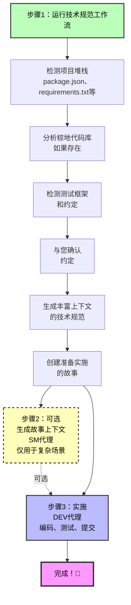

# BMad 快速规范流程

**完美适用于：** 错误修复、小功能、快速原型和快速增强

**到实施的时间：** 分钟，而不是小时

---

## 什么是快速规范流程？

快速规范流程是快速流程轨道项目的**简化替代方案**，相对于完整的BMad方法。您可以不经过产品简介 → PRD → 架构的流程，而是**直接进入上下文感知的技术规范**并开始编码。

### 何时使用快速规范流程

✅ **当以下情况时使用快速流程轨道：**

- 单个错误修复或小增强
- 范围明确的小功能（通常1-15个故事）
- 快速原型或实验
- 添加到现有棕地代码库
- 您确切知道要构建什么

❌ **当以下情况时使用BMad方法或企业轨道：**

- 构建新产品或主要功能
- 需要利益相关者对齐
- 复杂的多团队协调
- 需要广泛的规划和架构

💡 **不确定？** 运行`workflow-init`以根据您的项目需求获得建议！

---

## 快速规范流程概览



---

## 单个原子更改

**最适合：** 错误修复、单文件更改、独立改进

### 您将获得

1. **tech-spec.md** - 包含以下内容的综合技术规范：
   - 问题陈述和解决方案
   - 检测到的框架版本和依赖
   - 棕地代码模式（如果适用）
   - 要遵循的现有测试模式
   - 要修改的特定文件路径
   - 完整的实施指导

2. **story-[slug].md** - 准备开发的单个用户故事

### 快速规范流程命令

```bash
# 开始快速规范流程（无需workflow-init！）
# 加载PM代理并运行tech-spec

# 完成后，直接实施：
# 加载DEV代理并运行dev-story
```

### 为什么快速

- ✅ 不需要产品简介
- ✅ 不需要PRD
- ✅ 不需要架构文档
- ✅ 自动检测您的堆栈
- ✅ 自动分析棕地代码
- ✅ 自动验证质量
- ✅ 故事上下文可选（技术规范已经很全面！）

### 单个更改场景示例

- "修复登录验证错误"
- "在用户注册表单中添加邮箱字段"
- "更新API端点以返回额外字段"
- "改进支付处理中的错误处理"

---

## 内聚小功能

**最适合：** 具有2-3个相关用户故事的小功能

### 您将获得

1. **tech-spec.md** - 与单个更改项目相同的综合规范
2. **epics.md** - 带有故事分解的史诗组织
3. **story-[epic-slug]-1.md** - 第一个故事
4. **story-[epic-slug]-2.md** - 第二个故事
5. **story-[epic-slug]-3.md** - 第三个故事（如果需要）

### 快速规范流程命令

```bash
# 开始快速规范流程
# 加载PM代理并运行tech-spec

# 可选：将故事组织为冲刺
# 加载SM代理并运行sprint-planning

# 逐个故事实施：
# 为每个故事加载DEV代理并运行dev-story
```

### 故事排序

故事是**自动验证的**以确保正确顺序：

- ✅ 无前向依赖（故事2不能依赖故事3）
- ✅ 清晰的依赖文档
- ✅ 基础设施 → 功能 → 修饰顺序
- ✅ 后端 → 前端流程

### 小功能场景示例

- "添加OAuth社交登录（Google、GitHub、Twitter）"
- "构建带有头像上传的用户资料页面"
- "实现带过滤器的基本搜索"
- "向应用程序添加暗模式切换"

---

## 智能上下文发现

快速规范流程自动发现并使用：

### 1. 现有文档

- 产品简介（如果存在）
- 研究文档
- `document-project`输出（棕地代码库映射）

### 2. 项目堆栈

- **Node.js：** package.json → 框架、依赖、脚本、测试框架
- **Python：** requirements.txt、pyproject.toml → 包、工具
- **Ruby：** Gemfile → gems和版本
- **Java：** pom.xml、build.gradle → Maven/Gradle依赖
- **Go：** go.mod → 模块
- **Rust：** Cargo.toml → crates
- **PHP：** composer.json → 包

### 3. 棕地代码模式

- 目录结构和组织
- 现有代码模式（基于类、函数式、MVC）
- 命名约定（camelCase、snake_case、PascalCase）
- 测试框架和模式
- 代码风格（分号、引号、缩进）
- Linter/格式化器配置
- 错误处理模式
- 日志约定
- 文档风格

### 4. 约定确认

**重要：** 快速规范流程检测您的约定并**要求确认**：

```
我在您的代码库中检测到这些约定：

代码风格：
- 带有Airbnb配置的ESLint
- 带有单引号、2空格缩进的Prettier
- 无分号

测试模式：
- Jest测试框架
- .test.js文件命名
- expect()断言风格

我应该遵循这些现有约定吗？（是/否）
```

**您决定：** 遵循现有模式或建立新标准！

---

## 通过WebSearch的现代最佳实践

快速规范流程在适当时使用WebSearch保持最新：

### 对于绿地项目

- 搜索最新框架版本
- 推荐官方启动模板
- 建议现代最佳实践

### 对于过时依赖

- 检测您的依赖是否>2年
- 搜索迁移指南
- 注意升级复杂性

### 启动模板推荐

对于绿地项目，快速规范流程推荐：

**React：**

- Vite（现代、快速）
- Next.js（全栈）

**Python：**

- cookiecutter模板
- FastAPI启动器

**Node.js：**

- NestJS CLI
- express-generator

**好处：**

- ✅ 内置现代最佳实践
- ✅ 正确的项目结构
- ✅ 构建工具已配置
- ✅ 测试框架已设置
- ✅ 更快的首个功能时间

---

## UX/UI考虑

对于面向用户的更改，快速规范流程捕获：

- 受影响的UI组件（创建vs修改）
- UX流程更改（当前vs新）
- 响应式设计需求（移动、平板、桌面）
- 可访问性要求：
  - 键盘导航
  - 屏幕阅读器兼容性
  - ARIA标签
  - 颜色对比度标准
- 用户反馈模式：
  - 加载状态
  - 错误消息
  - 成功确认
  - 进度指示器

---

## 自动验证和质量保证

快速规范流程**自动验证**所有内容：

### 技术规范验证（始终运行）

检查：

- ✅ 上下文收集完整性
- ✅ 明确性（无"使用X或Y"语句）
- ✅ 棕地集成质量
- ✅ 堆栈对齐
- ✅ 实施就绪性

生成分数：

```
✅ 验证通过！
- 上下文收集：全面
- 明确性：全部明确
- 棕地集成：优秀
- 堆栈对齐：完美
- 实施就绪性：✅ 就绪
```

### 故事验证（多故事功能）

检查：

- ✅ 故事顺序（无前向依赖！）
- ✅ 验收标准质量（具体、可测试）
- ✅ 完整性（覆盖所有技术规范任务）
- ✅ 清晰的依赖文档

**如果发现问题会自动修复！**

---

## 完整用户旅程

### 场景1：错误修复（单个更改）

**目标：** 修复登录验证错误

**步骤：**

1. **开始：** 加载PM代理，说"我想修复登录验证错误"
2. **PM运行tech-spec工作流：**
   - 询问："您在解决什么问题？"
   - 您解释验证问题
   - 检测您的Node.js堆栈（Express 4.18.2、Jest用于测试）
   - 分析现有UserService代码模式
   - 询问："我应该遵循您的现有约定吗？" → 您说是
   - 生成带有特定文件路径和模式的tech-spec.md
   - 创建story-login-fix.md
3. **实施：** 加载DEV代理，运行`dev-story`
   - DEV读取tech-spec（有所有上下文！）
   - 遵循现有模式实施修复
   - 运行测试（遵循现有Jest模式）
   - 完成！

**总时间：** 15-30分钟（主要是实施）

---

### 场景2：小功能（多故事）

**目标：** 添加OAuth社交登录（Google、GitHub）

**步骤：**

1. **开始：** 加载PM代理，说"我想添加OAuth社交登录"
2. **PM运行tech-spec工作流：**
   - 询问功能范围
   - 您指定：Google和GitHub OAuth
   - 检测您的堆栈（Next.js 13.4、已安装NextAuth.js！）
   - 分析现有身份验证模式
   - 与您确认约定
   - 生成：
     - tech-spec.md（综合实施指南）
     - epics.md（OAuth集成史诗）
     - story-oauth-1.md（后端OAuth设置）
     - story-oauth-2.md（前端登录按钮）
3. **可选冲刺规划：** 加载SM代理，运行`sprint-planning`
4. **实施故事1：**
   - 加载DEV代理，为故事1运行`dev-story`
   - DEV实施后端OAuth
5. **实施故事2：**
   - DEV代理，为故事2运行`dev-story`
   - DEV实施前端
   - 完成！

**总时间：** 1-3小时（主要是实施）

---

## 与阶段4工作流的集成

快速规范流程与所有阶段4实施工作流无缝配合：

### story-context（SM代理）

- ✅ 识别tech-spec.md为权威来源
- ✅ 从tech-spec提取上下文（替换PRD）
- ✅ 为复杂场景生成XML上下文

### create-story（SM代理）

- ✅ 可以使用tech-spec.md而不是PRD
- ✅ 使用来自tech-spec工作流的epics.md
- ✅ 如果需要创建额外故事

### sprint-planning（SM代理）

- ✅ 使用来自tech-spec的epics.md
- ✅ 组织多故事功能进行协调实施
- ✅ 通过sprint-status.yaml跟踪进度

### dev-story（DEV代理）

- ✅ 读取由tech-spec生成的故事
- ✅ 使用tech-spec.md作为综合上下文
- ✅ 遵循检测到的约定实施

---

## 比较：快速规范 vs 完整BMM

| 方面                | 快速流程轨道             | BMad方法/企业轨道      |
| --------------------- | ---------------------------- | ---------------------------------- |
| **设置**             | 无（独立）            | 推荐workflow-init          |
| **规划文档**     | 仅tech-spec.md            | 产品简介 → PRD → 架构 |
| **到代码时间**      | 分钟                      | 小时到天                      |
| **最适合**          | 错误修复、小功能    | 新产品、主要功能       |
| **上下文发现** | 自动                    | 手动 + 指导                    |
| **故事上下文**     | 可选（tech-spec很丰富） | 必需（从PRD生成）      |
| **验证**        | 自动验证所有内容    | 手动验证步骤            |
| **棕地**        | 自动分析并遵循   | 需要手动文档      |
| **约定**       | 自动检测并确认    | 在PRD/架构中记录       |

---

## 何时从快速流程升级到BMad方法

从快速流程开始，但在以下情况切换到BMad方法：

- ❌ 项目超出初始范围
- ❌ 多个团队需要协调
- ❌ 利益相关者需要正式文档
- ❌ 产品愿景不明确
- ❌ 架构决策需要深入分析
- ❌ 存在合规/监管要求

💡 **提示：** 您可以随时运行`workflow-init`从快速流程转换到BMad方法！

---

## 快速规范流程 - 关键优势

### 🚀 **速度**

- 无产品简介
- 无PRD
- 无架构文档
- 直接进入实施

### 🧠 **智能**

- 自动检测堆栈
- 自动分析棕地
- 自动验证质量
- WebSearch获取最新信息

### 📐 **尊重现有代码**

- 检测约定
- 要求确认
- 遵循模式
- 适应vs更改

### ✅ **质量**

- 自动验证
- 明确决策（无"或"语句）
- 全面上下文
- 清晰验收标准

### 🎯 **专注**

- 单个原子更改
- 内聚小功能
- 无范围蔓延
- 快速迭代

---

## 入门指南

### 先决条件

- 已安装BMad方法（`npx bmad-method install`）
- 带有代码的项目目录（或绿地为空）

### 快速开始命令

```bash
# 对于快速错误修复或小更改：
# 1. 加载PM代理
# 2. 说："我想[描述您的更改]"
# 3. PM会询问您是否想运行tech-spec
# 4. 回答关于您更改的问题
# 5. 获得tech-spec + 故事
# 6. 加载DEV代理并实施！

# 对于带有多个故事的小功能：
# 同上，但获得史诗 + 2-3个故事
# 可选使用SM sprint-planning进行组织
```

### 无需workflow-init！

快速规范流程是**完全独立的**：

- 检测是单个更改还是多故事功能
- 询问绿地vs棕地
- 无需状态文件跟踪即可工作
- 完美用于快速原型

---

## FAQ

### 问：我可以在现有项目上使用快速规范流程吗？

**答：** 可以！它非常适合棕地项目。它会分析您的现有代码、检测模式，并询问您是否想遵循它们。

### 问：如果我没有package.json或requirements.txt怎么办？

**答：** 快速规范流程将以绿地模式工作，推荐启动模板，并使用WebSearch获取现代最佳实践。

### 问：我需要先运行workflow-init吗？

**答：** 不需要！快速规范流程是独立的。但如果您想要关于使用哪个流程的指导，workflow-init可以帮助。

### 问：我可以将其用于前端更改吗？

**答：** 当然可以！快速规范流程捕获UX/UI考虑、组件更改和可访问性需求。

### 问：如果我的快速流程项目增长了怎么办？

**答：** 没问题！您可以通过运行workflow-init和create-prd随时转换到BMad方法。您的tech-spec成为PRD的输入。

### 问：每个故事都需要story-context吗？

**答：** 通常不需要！Tech-spec对于大多数快速流程项目已经足够全面。仅对复杂的边缘情况使用story-context。

### 问：我可以跳过验证吗？

**答：** 不，验证始终自动运行。但它很快并能及早发现问题！

### 问：它会与我团队的代码风格一起工作吗？

**答：** 会！它检测您的约定并要求确认。您控制是遵循现有模式还是建立新模式。

---

## 技巧和最佳实践

### 1. **在发现中具体化**

描述您的更改时，提供具体信息：

- ✅ "修复UserService中的邮箱验证以允许加号地址"
- ❌ "修复验证错误"

### 2. **信任约定检测**

如果它正确检测到您的模式，就说是！这比建立新约定更快。

### 3. **对绿地使用WebSearch推荐**

启动模板节省数小时的设置时间。让快速规范流程找到最好的。

### 4. **审查自动验证**

当验证运行时，阅读分数。它们告诉您您的规范是否准备好生产。

### 5. **故事上下文是可选的**

对于单个更改，尝试直接进入dev-story。只有在遇到复杂性时才添加story-context。

### 6. **保持单个更改真正原子化**

如果您的"单个更改"需要3+个文件，它可能是一个多故事功能。让工作流指导您。

### 7. **为多故事功能验证故事顺序**

当您获得多个故事时，检查依赖验证输出。正确的顺序很重要！

---

## 真实世界示例

### 示例1：添加日志（单个更改）

**输入：** "向支付处理添加结构化日志"

**技术规范输出：**

- 检测：package.json中已有winston 3.8.2
- 分析：现有服务使用带JSON格式的winston
- 确认：遵循现有日志模式
- 生成：特定文件路径、日志级别、格式示例
- 故事：准备在1-2小时内实施

**结果：** 添加了一致的日志，遵循团队模式，无需研究。

---

### 示例2：搜索功能（多故事）

**输入：** "向产品目录添加带过滤器的搜索"

**技术规范输出：**

- 检测：React 18.2.0、MUI组件库、Express后端
- 分析：现有ProductList组件模式
- 确认：遵循现有API和组件结构
- 生成：
  - 史诗：产品搜索功能
  - 故事1：带过滤器的后端搜索API
  - 故事2：前端搜索UI组件
- 自动验证：故事1 → 故事2顺序正确

**结果：** 搜索功能在4-6小时内实施，具有适当的架构。

---

## 总结

快速规范流程是您的**从想法到实施的快速路径**，适用于：

- 🐛 错误修复
- ✨ 小功能
- 🚀 快速原型
- 🔧 快速增强

**关键特性：**

- 自动检测您的堆栈
- 自动分析棕地代码
- 自动验证质量
- 尊重现有约定
- 使用WebSearch获取现代实践
- 生成综合技术规范
- 创建实施就绪的故事

**到代码时间：** 分钟，不是小时。

**准备好尝试吗？** 加载PM代理并说出您想构建什么！🚀

---

## 下一步

- **立即尝试：** 加载PM代理并描述一个小更改
- **了解更多：** 参见[BMM工作流指南](./README.md#-workflow-guides)获取全面工作流文档
- **需要帮助决定？** 运行`workflow-init`获得推荐
- **有问题？** 在Discord加入我们：https://discord.gg/gk8jAdXWmj

---

_快速规范流程 - 因为不是每个更改都需要产品简介。_