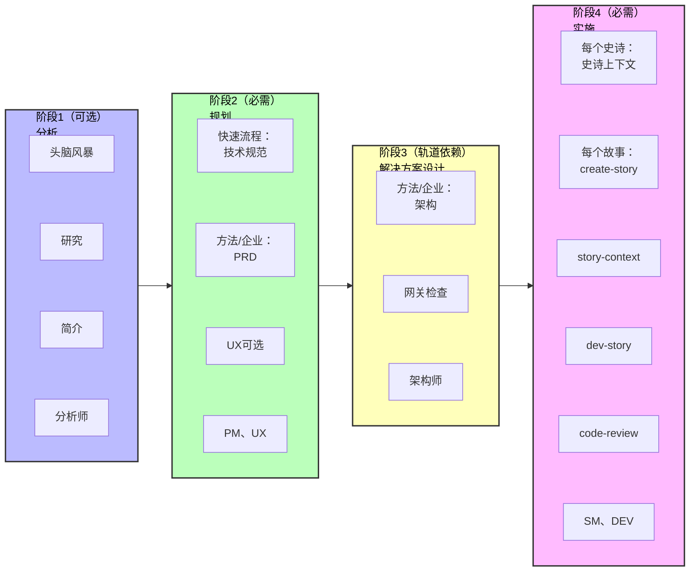

# BMad方法 V6 快速入门指南

使用BMad方法v6开始您的新绿地项目。本指南通过AI驱动的工作流指导您从头开始构建软件。

## 太长不看 - 快速路径

1. **安装**: `npx bmad-method@alpha install`
2. **初始化**: 加载分析师代理 → 运行"workflow-init"
3. **规划**: 加载PM代理 → 运行"prd"（或小项目运行"tech-spec"）
4. **架构**: 加载架构师代理 → 运行"create-architecture"（仅10+个故事）
5. **构建**: 加载SM代理 → 为每个故事运行工作流 → 加载DEV代理 → 实施
6. **始终使用新聊天**进行每个工作流以避免幻觉

---

## 什么是BMad方法？

BMad方法（BMM）通过专业AI代理的引导工作流帮助您构建软件。过程遵循四个阶段：

1. **阶段1：分析**（可选） - 头脑风暴、研究、产品简介
2. **阶段2：规划**（必需） - 创建您的需求（技术规范或PRD）
3. **阶段3：解决方案设计**（轨道依赖） - 为BMad方法和企业轨道设计架构
4. **阶段4：实施**（必需） - 逐个史诗、逐个故事地构建您的软件

## 安装

```bash
# 将v6 Alpha安装到您的项目
npx bmad-method@alpha install
```

交互式安装程序将引导您完成设置并创建一个包含所有代理和工作流的`bmad/`文件夹。

---

## 开始使用

### 步骤1：初始化您的工作流

1. **在您的IDE中加载分析师代理** - 参见[docs/ide-info](https://github.com/bmad-code-org/BMAD-METHOD/tree/main/docs/ide-info)中针对您IDE的具体说明，了解如何激活代理：
   - [Claude Code](https://github.com/bmad-code-org/BMAD-METHOD/blob/main/docs/ide-info/claude-code.md)
   - [VS Code/Cursor/Windsurf](https://github.com/bmad-code-org/BMAD-METHOD/tree/main/docs/ide-info) - 检查您的IDE文件夹
   - 也支持其他IDE
2. **等待代理的菜单**出现
3. **告诉代理**："运行workflow-init"或输入"*workflow-init"或选择菜单项编号

#### workflow-init期间会发生什么？

工作流是V6中的交互式过程，取代了之前版本的任务和模板。有许多类型的工作流，您甚至可以使用BMad Builder模块创建自己的工作流。对于BMad方法，您将与专家设计的工作流互动，这些工作流精心设计，与您协作以充分发挥您和LLM的优势。

在workflow-init期间，您将描述：

- 您的项目及其目标
- 是否有现有代码库或这是新项目
- 大致的规模和复杂性（您可以稍后调整）

#### 规划轨道

基于您的描述，工作流将建议一个轨道并让您选择：

**三个规划轨道：**

- **快速流程** - 快速实施（仅技术规范） - 错误修复、简单功能、明确范围（通常1-15个故事）
- **BMad方法** - 完整规划（PRD + 架构 + UX） - 产品、平台、复杂功能（通常10-50+个故事）
- **企业方法** - 扩展规划（BMad方法 + 安全/DevOps/测试） - 企业需求、合规、多租户（通常30+个故事）

**注意：** 故事数量是指导，不是定义。轨道基于规划需求选择，不是故事数学。

#### 创建了什么？

一旦您确认您的轨道，`bmm-workflow-status.yaml`文件将在您的项目docs文件夹中创建（假设默认安装位置）。此文件跟踪您在所有阶段的进度。

**重要说明：**

- 每个轨道都有不同的阶段路径
- 故事数量仍可根据整体复杂性在工作时更改
- 对于本指南，我们假设BMad方法轨道项目
- 此工作流将指导您完成阶段1（可选）、阶段2（必需）和阶段3（BMad方法和企业轨道必需）

### 步骤2：完成阶段1-3

workflow-init完成后，您将完成规划阶段。**重要：为每个工作流使用新聊天以避免上下文限制。**

#### 检查您的状态

如果您不确定下一步做什么：

1. 在新聊天中加载任何代理
2. 询问"workflow-status"
3. 代理将告诉您下一个推荐或必需的工作流

**示例响应：**

```
阶段1（分析）完全可选。所有工作流都是可选或推荐的：
  - brainstorm-project - 可选
  - research - 可选
  - product-brief - 推荐（但不是必需的）

下一个真正必需的步骤是：
  - 阶段2 - 规划中的PRD（产品需求文档）
  - 代理：pm
  - 命令：prd
```

#### 如何在阶段1-3中运行工作流

当代理告诉您运行工作流（如`prd`）时：

1. **使用指定代理开始新聊天**（例如，PM） - 参见[docs/ide-info](https://github.com/bmad-code-org/BMAD-METHOD/tree/main/docs/ide-info)了解您IDE的具体说明
2. **等待菜单**出现
3. **告诉代理**使用以下任何格式运行它：
   - 输入简写：`*prd`
   - 自然地说："让我们创建一个新的PRD"
   - 选择"create-prd"的菜单编号

V6中的代理在模糊菜单匹配方面非常出色！

#### 快速参考：代理 → 文档映射

对于v4用户或那些喜欢跳过workflow-status指导的用户：

- **分析师** → 头脑风暴、产品简介
- **PM** → PRD（BMad方法/企业轨道）或技术规范（快速流程轨道）
- **UX设计师** → UX设计文档（如果UI重度）
- **架构师** → 架构（BMad方法/企业轨道）

#### 阶段2：规划 - 创建PRD

**对于BMad方法和企业轨道：**

1. 在新聊天中加载**PM代理**
2. 告诉它运行PRD工作流
3. 完成后，您将拥有：
   - **PRD.md** - 您的产品需求文档
   - 史诗分解

**对于快速流程轨道：**

- 使用**技术规范**代替PRD（不需要架构）

#### 阶段2（可选）：UX设计

如果您的项目有用户界面：

1. 在新聊天中加载**UX设计师代理**
2. 告诉它运行UX设计工作流
3. 完成后，运行验证以确保Epics文件保持更新

#### 阶段3：架构

**对于BMad方法和企业轨道：**

1. 在新聊天中加载**架构师代理**
2. 告诉它运行create-architecture工作流
3. 完成后，运行验证以确保Epics文件保持更新

#### 阶段3：解决方案设计网关检查（强烈推荐）

架构完成后：

1. 在新聊天中加载**架构师代理**
2. 告诉它运行"solutioning-gate-check"
3. 这验证所有规划文档（PRD、UX、架构、Epics）的内聚性
4. 这在v4中被称为"PO主检查清单"

**为什么运行这个？** 它确保您在开始构建之前所有规划资产都正确对齐。

#### 上下文管理技巧

- **使用200k+上下文模型**以获得最佳结果（Claude Sonnet 4.5、GPT-4等）
- **每个工作流使用新聊天** - 头脑风暴、简介、研究和PRD生成都需要大量上下文
- **无需文档分片** - 与v4不同，您不需要拆分文档
- **Web Bundle即将推出** - 将帮助有限计划的用户节省LLM令牌

### 步骤3：开始构建（阶段4 - 实施）

一旦规划和架构完成，您将进入阶段4。**重要：下面的每个工作流都应该在新聊天中运行，以避免上下文限制和幻觉。**

#### 3.1 初始化冲刺规划

1. **使用SM（Scrum主管）代理开始新聊天**
2. 等待菜单出现
3. 告诉代理："运行sprint-planning"
4. 这会创建跟踪所有史诗和故事的`sprint-status.yaml`文件

#### 3.2 创建史诗上下文（可选但推荐）

1. **使用SM代理开始新聊天**
2. 等待菜单
3. 告诉代理："运行epic-tech-context"
4. 这在起草故事之前为当前史诗创建技术上下文

#### 3.3 起草您的第一个故事

1. **使用SM代理开始新聊天**
2. 等待菜单
3. 告诉代理："运行create-story"
4. 这从史诗起草故事文件

#### 3.4 添加故事上下文（可选但推荐）

1. **使用SM代理开始新聊天**
2. 等待菜单
3. 告诉代理："运行story-context"
4. 这为故事创建实施特定的技术上下文

#### 3.5 实施故事

1. **使用DEV代理开始新聊天**
2. 等待菜单
3. 告诉代理："运行dev-story"
4. DEV代理将实施故事并更新冲刺状态

#### 3.6 审查代码（可选但推荐）

1. **使用DEV代理开始新聊天**
2. 等待菜单
3. 告诉代理："运行code-review"
4. DEV代理执行质量验证（这在v4中被称为QA）

### 步骤4：继续

对于每个后续故事，使用**新聊天**为每个工作流重复循环：

1. **新聊天** → SM代理 → "运行create-story"
2. **新聊天** → SM代理 → "运行story-context"
3. **新聊天** → DEV代理 → "运行dev-story"
4. **新聊天** → DEV代理 → "运行code-review"（可选但推荐）

完成史诗中的所有故事后：

1. **使用SM代理开始新聊天**
2. 告诉代理："运行retrospective"

**为什么使用新聊天？** 如果您在同一聊天中继续发出命令，上下文密集的工作流可能会导致幻觉。重新开始确保代理在每个工作流中具有最大的上下文容量。

---

## 理解代理

每个代理都是专业化的AI角色：

- **分析师** - 初始化工作流并跟踪进度
- **PM** - 创建需求和规范
- **UX设计师** - 如果您的项目有前端 - 这个设计师将帮助生成工件，提出模型更新，并在您指导下设计出色的外观和感觉。
- **架构师** - 设计系统架构
- **SM（Scrum主管）** - 管理冲刺并创建故事
- **DEV** - 实施代码并审查工作

## 工作流如何工作

1. **加载代理** - 在IDE中打开代理文件以激活它
2. **等待菜单** - 代理将呈现其可用的工作流
3. **告诉代理运行什么** - 说"运行[工作流名称]"
4. **遵循提示** - 代理指导您完成每个步骤

代理在整个过程中创建文档、提出问题并帮助您做出决策。

## 项目跟踪文件

BMad创建两个文件来跟踪您的进度：

**1. bmm-workflow-status.yaml**

- 显示您所在的阶段和下一步是什么
- 由workflow-init创建
- 随着您在阶段中进展自动更新

**2. sprint-status.yaml**（仅阶段4）

- 在实施期间跟踪您的所有史诗和故事
- 对SM和DEV代理知道下一步要做什么至关重要
- 由sprint-planning工作流创建
- 随着故事进展自动更新

**您无需手动编辑这些** - 代理在您工作时更新它们。

---

## 完整流程可视化



## 常见问题

**问：我总是需要架构吗？**
答：仅BMad方法和企业轨道需要。快速流程项目直接从技术规范跳到实施。

**问：我以后可以更改我的计划吗？**
答：可以！SM代理有一个"correct-course"工作流来处理范围变更。

**问：如果我想先头脑风暴怎么办？**
答：加载分析师代理并告诉它在运行workflow-init之前"运行brainstorm-project"。

**问：为什么每个工作流都需要新聊天？**
答：上下文密集的工作流如果顺序运行可能会导致幻觉。新聊天确保最大的上下文容量。

**问：我可以跳过workflow-init和workflow-status吗？**
答：可以，一旦您学习了流程。使用步骤2中的快速参考直接转到您需要的工作流。

## 获取帮助

- **工作流期间：** 代理通过问题和解释指导您
- **社区：** [Discord](https://discord.gg/gk8jAdXWmj) - #general-dev、#bugs-issues
- **完整指南：** [BMM工作流文档](./README.md#-workflow-guides)
- **YouTube教程：** [BMad代码频道](https://www.youtube.com/@BMadCode)

---

## 关键要点

✅ **始终使用新聊天** - 在新聊天中为每个工作流加载代理以避免上下文问题
✅ **让workflow-status指导您** - 当不确定下一步时加载任何代理并询问状态
✅ **轨道很重要** - 快速流程使用技术规范，BMad方法/企业需要PRD和架构
✅ **跟踪是自动的** - 状态文件自动更新，无需手动编辑
✅ **代理是灵活的** - 使用菜单编号、快捷键（*prd）或自然语言

**准备好开始构建了吗？** 安装BMad，加载分析师，运行workflow-init，让代理指导您！