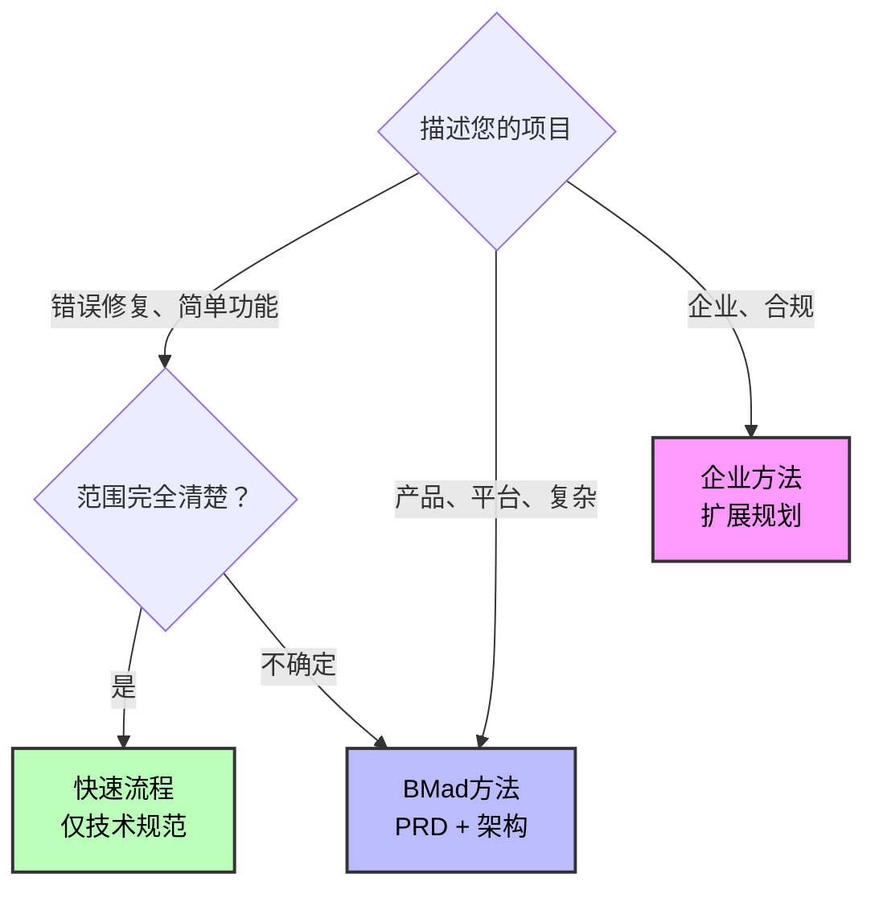
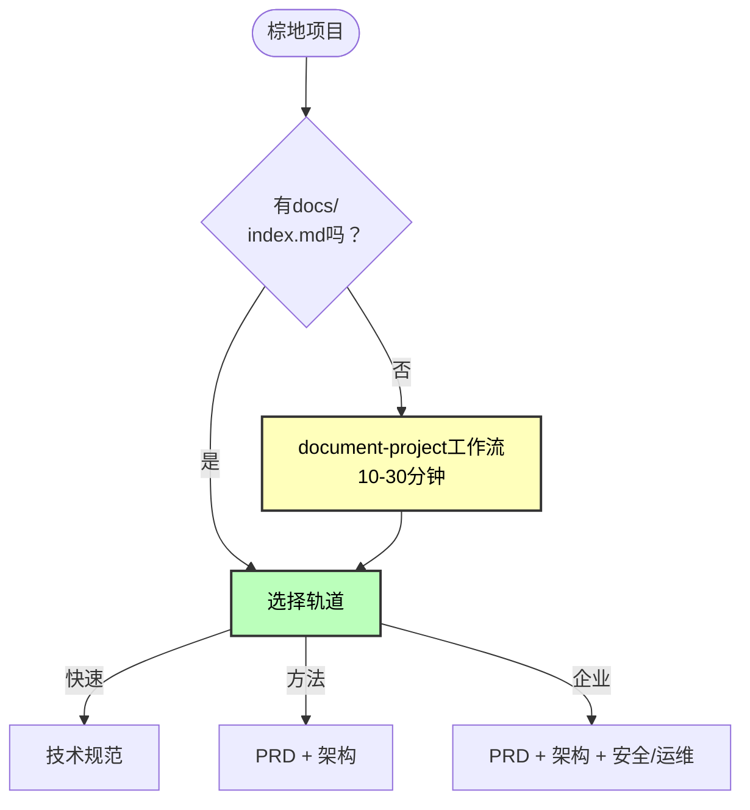

# BMad方法规模自适应系统

**自动将工作流适应项目复杂性 - 从快速修复到企业系统**

---

## 概览

**规模自适应系统**智能地将项目路由到正确的规划方法，基于复杂性而不是任意的故事计数。

### 问题

传统方法论对每个项目应用相同的流程：

- 错误修复需要完整的设计文档
- 企业系统用最少的规划构建
- 一刀切的方法

### 解决方案

BMad方法适应三个不同的规划轨道：

- **快速流程**：仅技术规范，立即实施
- **BMad方法**：PRD + 架构，结构化方法
- **企业方法**：包含安全/DevOps/测试的完整规划

**结果**：每个项目都有正确的规划深度。

---

## 快速参考

### 三个轨道一览

| 轨道                 | 规划深度        | 时间投入 | 最适合                                   |
| --------------------- | --------------------- | --------------- | ------------------------------------------ |
| **快速流程**        | 仅技术规范        | 小时到1天  | 简单功能、错误修复、明确范围    |
| **BMad方法**       | PRD + 架构 + UX       | 1-3天        | 产品、平台、复杂功能      |
| **企业方法** | 方法 + 测试/安全/运维 | 3-7天        | 企业需求、合规、多租户 |

### 决策树



### 快速关键词

- **快速流程**：修复、错误、简单、添加、明确范围
- **BMad方法**：产品、平台、仪表板、复杂、多个功能
- **企业方法**：企业、多租户、合规、安全、审计

---

## 轨道选择如何工作

当您运行`workflow-init`时，它通过教育性选择指导您：

### 1. 描述分析

分析您的项目描述以获取复杂性指标并建议适当的轨道。

### 2. 教育性呈现

显示所有三个轨道，包括：

- 时间投入
- 规划方法
- 好处和权衡
- AI代理支持级别
- 具体示例

### 3. 诚实推荐

基于以下内容提供定制化建议：

- 复杂性关键词
- 绿地vs棕地
- 用户的描述

### 4. 用户选择

您选择适合您情况的轨道。系统指导但从不强制。

**示例：**

```
workflow-init: "基于'添加带有分析功能的用户仪表板'，我推荐BMad方法。
               这涉及多个功能和系统设计。PRD + 架构
               为AI代理提供完整上下文以获得更好的代码生成。"

您："实际上，这比听起来更简单。快速流程。"

workflow-init: "明白了！使用带有技术规范的快速流程。"
```

---

## 三个轨道

### 轨道1：快速流程

**定义**：使用技术规范规划的快速实施。

**时间**：小時到1天的规划

**规划文档**：

- Tech-spec.md（实施聚焦）
- 故事文件（通常1-15个，自动检测史诗结构）

**工作流路径**：

```
（棕地：如需要先运行document-project）
↓
技术规范 → 实施
```

**适用于**：

- 错误修复
- 简单功能
- 范围明确的增强
- 快速添加

**故事数量**：通常1-15个故事（指导，不是规则）

**示例**："修复身份验证令牌过期错误"

**AI代理支持**：基础 - 提供最少上下文

**权衡**：较少规划 = 如果出现复杂性，返工风险更高

---

### 轨道2：BMad方法（推荐）

**定义**：完整产品 + 系统设计规划。

**时间**：1-3天的规划

**规划文档**：

- PRD.md（产品需求）
- Architecture.md（系统设计）
- UX设计（如果有UI组件）
- 带故事的史诗分解

**工作流路径**：

```
（棕地：如需要先运行document-project）
↓
（可选：分析阶段 - 头脑风暴、研究、产品简介）
↓
PRD → （可选UX） → 架构 → 网关检查 → 实施
```

**适用于**：

**绿地**：

- 产品
- 平台
- 多功能举措

**棕地**：

- 复杂添加（新UI + API）
- 主要重构
- 新模块

**故事数量**：通常10-50+个故事（指导，不是规则）

**示例**：

- "带有分析和偏好的用户仪表板"
- "向现有文档编辑器添加实时协作"
- "支付集成系统"

**AI代理支持**：出色 - 编码伙伴的完整上下文

**为什么棕地需要架构？**

您的棕地文档可能很庞大。架构工作流将庞大的代码库上下文提炼成专门针对您项目的集中解决方案设计。这使AI代理专注而不会在现有代码中迷失。

**好处**：

- 完整的AI代理上下文
- 防止架构漂移
- 实施过程中更少意外
- 更好的代码质量
- 更快的整体交付（规划会得到回报）

---

### 轨道3：企业方法

**定义**：包含安全、DevOps和测试策略的扩展规划。

**时间**：3-7天的规划

**规划文档**：

- 所有BMad方法文档加上：
- 安全架构
- DevOps策略
- 测试策略
- 合规文档

**工作流路径**：

```
（棕地：几乎必须运行document-project）
↓
分析（推荐/必需） → PRD → UX → 架构
↓
安全架构 → DevOps策略 → 测试策略
↓
网关检查 → 实施
```

**适用于**：

- 企业需求
- 多租户系统
- 合规需求（HIPAA、SOC2等）
- 关键任务系统
- 安全敏感的应用程序

**故事数量**：通常30+个故事（但由企业需求定义，不是计数）

**示例**：

- "多租户SaaS平台"
- "HIPAA合规的患者门户"
- "向企业应用添加SOC2审计日志"

**AI代理支持**：精英级 - 综合企业规划

**对企业至关重要**：

- 安全架构和威胁建模
- DevOps管道规划
- 综合测试策略
- 风险评估
- 合规映射

---

## 按轨道的规划文档

### 快速流程文档

**创建时间**：规划阶段前期

**技术规范**：

- 问题陈述和解决方案
- 源代码树更改
- 技术实施细节
- 检测到的堆栈和约定（棕地）
- UX/UI考虑（如果面向用户）
- 测试策略

**用作**：完整规划文档（替换PRD + 架构）

---

### BMad方法文档

**创建时间**：规划和解决方案设计阶段前期

**PRD（产品需求文档）**：

- 产品愿景和目标
- 功能需求
- 带故事的史诗分解
- 成功标准
- 用户体验考虑
- 业务上下文

**架构文档**：

- 系统组件和职责
- 数据模型和架构
- 集成模式
- 安全架构
- 性能考虑
- 部署架构

**对于棕地**：作为集中的"解决方案设计"，将现有代码库提炼为集成计划

---

### 企业方法文档

**创建时间**：跨多个阶段的扩展规划

包含所有BMad方法文档加上：

**安全架构**：

- 威胁建模
- 身份验证/授权设计
- 数据保护策略
- 审计要求

**DevOps策略**：

- CI/CD管道设计
- 基础设施架构
- 监控和告警
- 灾难恢复

**测试策略**：

- 测试方法和覆盖范围
- 自动化策略
- 质量网关
- 性能测试

---

## 工作流比较

| 轨道           | 分析    | 规划  | 架构 | 安全/运维 | 典型故事 |
| --------------- | ----------- | --------- | ------------ | ------------ | --------------- |
| **快速流程**  | 可选    | 技术规范 | 无         | 无         | 1-15            |
| **BMad方法** | 推荐 | PRD + UX  | 必需     | 无         | 10-50+          |
| **企业**  | 必需    | PRD + UX  | 必需     | 必需     | 30+             |

**注意**：故事数量是基于典型使用的指导，不是轨道的定义。

---

## 棕地项目

### 关键第一步

对于所有棕地项目：在规划工作流之前运行`document-project`。

### 为什么document-project至关重要

**快速流程**使用它来：

- 自动检测现有模式
- 理解代码库结构
- 确认约定

**BMad方法**使用它来：

- 架构输入（现有结构）
- 集成设计
- 模式一致性

**企业方法**使用它来：

- 安全分析
- 集成架构
- 风险评估

### 棕地工作流模式



---

## 常见场景

### 场景1：错误修复（快速流程）

**输入**："修复登录表单中的邮箱验证错误"

**检测**：关键词"修复"、"错误"

**轨道**：快速流程

**工作流**：

1. （可选）简要分析
2. 带单个故事的技术规范
3. 立即实施

**时间**：总计2-4小时

---

### 场景2：小功能（快速流程）

**输入**："添加OAuth社交登录（Google、GitHub、Facebook）"

**检测**：关键词"添加"、"功能"、明确范围

**轨道**：快速流程

**工作流**：

1. （可选）研究OAuth提供商
2. 带3个故事的技术规范
3. 逐个故事实施

**时间**：1-3天

---

### 场景3：客户门户（BMad方法）

**输入**："构建带有仪表板、工单、账单的客户门户"

**检测**：关键词"门户"、"仪表板"、多个功能

**轨道**：BMad方法

**工作流**：

1. （推荐）产品简介
2. 带史诗的PRD
3. （如果有UI）UX设计
4. 架构（系统设计）
5. 网关检查
6. 使用冲刺规划实施

**时间**：1-2周

---

### 场景4：电商平台（BMad方法）

**输入**："构建带有产品、购物车、结账、管理、分析的电商平台"

**检测**：关键词"平台"、多个子系统

**轨道**：BMad方法

**工作流**：

1. 研究 + 产品简介
2. 综合PRD
3. UX设计（推荐）
4. 系统架构（必需）
5. 网关检查
6. 使用分阶段方法实施

**时间**：3-6周

---

### 场景5：棕地添加（BMad方法）

**输入**："向现有产品目录添加搜索功能"

**检测**：棕地 + 中等复杂性

**轨道**：BMad方法（不是快速流程）

**关键第一步**：

1. **运行document-project** 分析现有代码库

**然后工作流**：2. 搜索功能的PRD 3. 架构（集成设计 - 强烈推荐）4. 遵循现有模式实施

**时间**：1-2周

**为什么使用方法而不是快速流程？** 与现有目录系统的集成受益于架构规划以确保一致性。

---

### 场景6：多租户平台（企业方法）

**输入**："向现有单租户SaaS平台添加多租户"

**检测**：关键词"多租户"、企业规模

**轨道**：企业方法

**工作流**：

1. Document-project（必需）
2. 研究（合规、安全）
3. PRD（多租户需求）
4. 架构（租户隔离设计）
5. 安全架构（数据隔离、身份验证）
6. DevOps策略（租户供应、监控）
7. 测试策略（租户隔离测试）
8. 网关检查
9. 分阶段实施

**时间**：3-6个月

---

## 最佳实践

### 1. 棕地优先使用Document-Project

在开始棕地规划之前始终运行`document-project`。AI代理需要现有代码库上下文。

### 2. 信任推荐

如果`workflow-init`建议BMad方法，可能存在您没有考虑的复杂性。在覆盖之前仔细审查。

### 3. 不确定时从较小的开始

在快速流程和方法之间不确定？从快速流程开始。如果需要，您可以稍后创建PRD。

### 4. 不要跳过网关检查

对于BMad方法和企业，网关检查防止代价高昂的错误。投入时间。

### 5. 架构对棕地是可选但推荐的

棕地BMad方法使架构可选，但强烈推荐。它将复杂的代码库提炼为集中的解决方案设计。

### 6. 基于需求的发现阶段

无论轨道如何都提供头脑风暴和研究。当您需要思考问题空间时使用它们。

### 7. 绿地方法的产品简介

产品简介仅提供给绿地BMad方法和企业。它是可选的，但有助于战略思考。

---

## 与旧系统的关键差异

### 旧系统（级别0-4）

- 任意故事计数阈值
- 基于故事计数的级别2 vs 级别3
- 令人困惑的重叠区域（5-10个故事，12-40个故事）
- 技术规范和PRD显示为冲突选项

### 新系统（3个轨道）

- 基于方法论的区分（不是故事计数）
- 故事数量作为指导，不是定义
- 清晰的轨道目的：
  - 快速流程 = 实施聚焦
  - BMad方法 = 产品 + 系统设计
  - 企业 = 扩展安全/运维
- 前期选择的互斥路径
- 教育性决策制定

---

## 从旧系统迁移

如果您有使用旧级别系统的现有项目：

- **级别0-1** → 快速流程
- **级别2-3** → BMad方法
- **级别4** → 企业方法

在现有项目上运行`workflow-init`以迁移到新的跟踪系统。它检测现有的规划工件并创建适当的工作流跟踪。

---

## 相关文档

- **[快速入门指南](./quick-start_zh.md)** - 开始使用BMM
- **[快速规范流程](./quick-spec-flow_zh.md)** - 快速流程轨道的详细信息
- **[棕地指南](./brownfield-guide_zh.md)** - 现有代码库工作流
- **[术语表](./glossary_zh.md)** - 完整术语
- **[FAQ](./faq_zh.md)** - 常见问题
- **[工作流指南](./README_zh.md#-workflow-guides)** - 完整工作流参考

---

_规模自适应系统 - 每个项目的正确规划深度。_