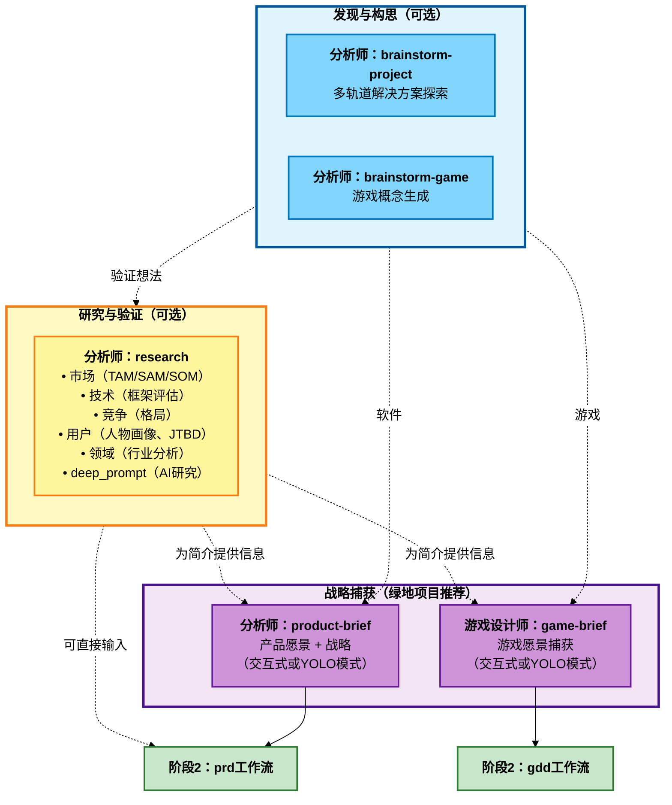

# BMM 分析工作流（阶段1）

**阅读时间：** 约7分钟

## 概览

阶段1（分析）工作流是**可选的**探索和发现工具，有助于在规划开始前验证想法、理解市场并生成战略背景。

**关键原则：** 分析工作流帮助您在承诺实施前进行战略性思考。如果需求已经明确，请跳过它们。

**何时使用：** 开始新项目、探索机会、验证市场契合度、生成想法、理解问题空间。

**何时跳过：** 继续具有明确需求的现有项目、具有已知解决方案的明确定义功能、发现已完成的严格约束项目。

---

## 阶段1分析工作流图谱



---

## 快速参考

| 工作流               | 代理         | 是否必需    | 目的                                                        | 输出                       |
| ---------------------- | ------------- | ----------- | -------------------------------------------------------------- | ---------------------------- |
| **brainstorm-project** | 分析师       | 否          | 探索解决方案方法和架构                  | 解决方案选项 + 理由 |
| **brainstorm-game**    | 分析师       | 否          | 使用创意技术生成游戏概念               | 游戏概念 + 评估   |
| **research**           | 分析师       | 否          | 多类型研究（市场/技术/竞争/用户/领域） | 研究报告             |
| **product-brief**      | 分析师       | 推荐 | 定义产品愿景和战略（交互式）               | 产品简介文档       |
| **game-brief**         | 游戏设计师 | 推荐 | 在GDD之前捕获游戏愿景（交互式）                   | 游戏简介文档          |

---

## 工作流描述

### brainstorm-project

**目的：** 通过并行构思轨道（架构、UX、集成、价值）生成多种解决方案方法。

**代理：** 分析师

**何时使用：**

- 技术方法不明确但有业务目标
- 需要评估多个解决方案路径
- 需要发现隐藏假设
- 超越明显解决方案的创新

**关键输出：**

- 带有权衡分析的架构提案
- 价值框架（优先功能）
- 风险分析（依赖关系、挑战）
- 带有理由的战略建议

**示例：** "我们需要一个客户仪表板" → 选项：单体SSR（更快）、微服务SPA（可扩展）、混合（平衡）并附建议。

---

### brainstorm-game

**目的：** 使用五种头脑风暴技术通过系统性创意探索生成游戏概念。

**代理：** 分析师

**何时使用：**

- 生成原创游戏概念
- 探索主题变体
- 打破创意瓶颈
- 根据约束验证游戏想法

**使用技术：**

- SCAMPER（系统性修改）
- 思维导图（分层探索）
- 莲花绽放（径向扩展）
- 六顶思考帽（多视角）
- 随机词联想（横向思维）

**关键输出：**

- 方法特定工件（5个独立文档）
- 带有可行性的整合概念文档
- 设计支柱对齐矩阵

**示例：** "带有心理主题的Roguelike" → 情感作为角色、心魔作为敌人、治疗会话作为休息点、牌组构成影响叙事。

---

### research

**目的：** 整合市场、技术、竞争、用户和领域分析的综合多类型研究系统。

**代理：** 分析师

**研究类型：**

| 类型            | 目的                                                | 使用时机                            |
| --------------- | ------------------------------------------------------ | ----------------------------------- |
| **market**      | TAM/SAM/SOM、竞争分析                      | 需要市场可行性验证    |
| **technical**   | 技术评估、ADR                            | 选择框架/平台       |
| **competitive** | 深度竞争对手分析                               | 理解竞争格局 |
| **user**        | 客户洞察、人物画像、JTBD                      | 需要用户理解             |
| **domain**      | 行业深度研究、趋势                            | 理解领域/行业       |
| **deep_prompt** | 生成AI研究提示（ChatGPT、Claude、Gemini） | 需要更深入的AI辅助研究    |

**关键特性：**

- 实时网络研究
- 多种分析框架（波特五力、SWOT、技术采用生命周期）
- 针对deep_prompt类型的平台特定优化
- 可配置研究深度（快速/标准/全面）

**示例（市场）：** "SaaS项目管理工具" → TAM 500亿美元，SAM 50亿美元，SOM 5000万美元，顶级竞争对手（Asana、Monday）、定位建议。

---

### product-brief

**目的：** 交互式产品简介创建，指导战略产品愿景定义。

**代理：** 分析师

**何时使用：**

- 开始新产品/主要功能倡议
- 在详细规划前统一利益相关者
- 从探索转向战略
- 需要高管级产品文档

**模式：**

- **交互式模式**（推荐）：通过探究问题进行分步协作开发
- **YOLO模式**：AI从上下文生成完整草稿，然后迭代优化

**关键输出：**

- 执行摘要
- 带有证据的问题陈述
- 建议的解决方案和差异化因素
- 目标用户（分段）
- MVP范围（无情的定义）
- 财务影响和ROI
- 战略对齐
- 风险和未决问题

**集成：** 直接输入到PRD工作流（阶段2）。

---

### game-brief

**目的：** 轻量级交互式头脑风暴会议，在游戏设计文档之前捕获游戏愿景。

**代理：** 游戏设计师

**何时使用：**

- 开始新游戏项目
- 在承诺前探索游戏想法
- 向团队/利益相关者推介概念
- 验证市场契合度和可行性

**游戏简介 vs GDD：**

| 方面       | 游戏简介         | GDD                       |
| ------------ | ------------------ | ------------------------- |
| 目的      | 验证概念   | 为实施而设计 |
| 详细级别 | 高层愿景  | 详细规格            |
| 格式       | 对话式     | 结构化                |
| 输出       | 简洁愿景文档 | 综合设计      |

**关键输出：**

- 游戏愿景（概念、推介）
- 目标市场和定位
- 核心游戏支柱
- 范围和约束
- 参考框架
- 风险评估
- 成功标准

**集成：** 输入到GDD工作流（阶段2）。

---

## 决策指南

### 开始软件项目

```
brainstorm-project（如果不明确）→ research（市场/技术）→ product-brief → 阶段2（prd）
```

### 开始游戏项目

```
brainstorm-game（如果生成概念）→ research（市场/竞争）→ game-brief → 阶段2（gdd）
```

### 验证想法

```
research（市场类型）→ product-brief 或 game-brief → 阶段2
```

### 仅技术决策

```
research（技术类型）→ 在阶段3（架构）中使用发现
```

### 理解市场

```
research（市场/竞争类型）→ product-brief → 阶段2
```

---

## 与阶段2（规划）的集成

分析输出直接输入到规划：

| 分析输出             | 规划输入             |
| --------------------------- | -------------------------- |
| product-brief.md            | **prd** 工作流           |
| game-brief.md               | **gdd** 工作流           |
| market-research.md          | **prd** 上下文            |
| technical-research.md       | **architecture**（阶段3） |
| competitive-intelligence.md | **prd** 定位        |

规划工作流如果这些文档存在于输出文件夹中会自动加载它们。

---

## 最佳实践

### 1. 不要过度投入分析

分析是可选的。如果需求明确，跳到阶段2（规划）。

### 2. 在工作流之间迭代

常见模式：brainstorm → research（验证）→ brief（综合）

### 3. 记录假设

分析揭示和验证假设。为规划明确记录它们以进行挑战。

### 4. 保持战略性

关注"什么"和"为什么"，而不是"如何"。将实施留给规划和解决方案设计。

### 5. 涉及利益相关者

使用分析工作流在承诺详细规划前统一利益相关者。

---

## 常见模式

### 绿地软件（完整分析）

```
1. brainstorm-project - 探索方法
2. research（市场）- 验证可行性
3. product-brief - 捕获战略愿景
4. → 阶段2：prd
```

### 绿地游戏（完整分析）

```
1. brainstorm-game - 生成概念
2. research（竞争）- 理解格局
3. game-brief - 捕获愿景
4. → 阶段2：gdd
```

### 跳过分析（明确需求）

```
→ 阶段2：直接进行prd或tech-spec
```

### 仅技术研究

```
1. research（技术）- 评估技术
2. → 阶段3：架构（在ADR中使用发现）
```

---

## 相关文档

- [阶段2：规划工作流](./workflows-planning_zh.md) - 下一阶段
- [阶段3：解决方案设计工作流](./workflows-solutioning_zh.md)
- [阶段4：实施工作流](./workflows-implementation_zh.md)
- [规模自适应系统](./scale-adaptive-system_zh.md) - 理解项目复杂性
- [代理指南](./agents-guide_zh.md) - 完整代理参考

---

## 故障排除

**问：我需要运行所有分析工作流吗？**
答：不！分析完全是可选的。只使用帮助您思考问题的工作流。

**问：我应该从哪个工作流开始？**
答：如果不确定，从`research`（市场类型）开始验证可行性，然后转到`product-brief`或`game-brief`。

**问：我可以直接跳到规划吗？**
答：可以！如果您知道要构建什么以及为什么，完全跳过阶段1并从阶段2（prd/gdd/tech-spec）开始。

**问：分析应该花费多长时间？**
答：通常几小时到1-2天。如果花费更长时间，您可能过度分析了。转向规划。

**问：如果在分析期间发现问题怎么办？**
答：这正是重点！分析帮助您在大量规划投资前快速失败并转型。

**问：棕地项目应该做分析吗？**
答：通常不需要。从`document-project`（阶段0）开始，然后跳到规划（阶段2）。

---

_阶段1分析 - 承诺前的可选战略思考。_