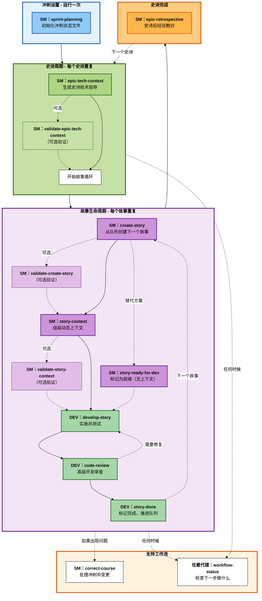

# BMM 实施工作流（阶段4）

**阅读时间：** 约8分钟

## 概览

阶段4（实施）工作流使用**以故事为中心的工作流**管理迭代式基于冲刺的开发周期，每个故事都通过定义的生命周期从创建到完成。

**关键原则：** 一次一个故事，在开始下一个之前完成整个生命周期。

---

## 阶段4工作流生命周期



---

## 快速参考

| 工作流                       | 代理 | 何时                             | 目的                                     |
| ------------------------------ | ----- | -------------------------------- | ------------------------------------------- |
| **sprint-planning**            | SM    | 阶段4开始时运行一次            | 初始化冲刺跟踪文件             |
| **epic-tech-context**          | SM    | 每个史诗                         | 生成史诗特定的技术指导   |
| **validate-epic-tech-context** | SM    | epic-tech-context后的可选操作 | 根据检查清单验证技术规范        |
| **create-story**               | SM    | 每个故事                        | 从史诗待办事项创建下一个故事         |
| **validate-create-story**      | SM    | create-story后的可选操作      | 故事草稿的独立验证       |
| **story-context**              | SM    | 每个故事可选               | 组装动态故事上下文XML          |
| **validate-story-context**     | SM    | story-context后的可选操作     | 根据检查清单验证故事上下文    |
| **story-ready-for-dev**        | SM    | 每个故事可选               | 标记故事就绪（不生成上下文） |
| **develop-story**              | DEV   | 每个故事                        | 实施故事并测试                  |
| **code-review**                | DEV   | 每个故事                        | 高级开发质量审查                   |
| **story-done**                 | DEV   | 每个故事                        | 标记完成并推进队列             |
| **epic-retrospective**         | SM    | 史诗完成后              | 审查经验并提取洞察         |
| **correct-course**             | SM    | 出现问题时                | 处理重要的冲刺中变更       |
| **workflow-status**            | 任意   | 任何时候                          | 检查"我现在应该做什么？"               |

---

## 代理角色

### SM（Scrum Master）- 主要实施协调者

**工作流：** sprint-planning, epic-tech-context, validate-epic-tech-context, create-story, validate-create-story, story-context, validate-story-context, story-ready-for-dev, epic-retrospective, correct-course

**职责：**

- 初始化和维护冲刺跟踪
- 生成技术上下文（史诗和故事级别）
- 协调带有可选验证的故事生命周期
- 标记故事准备好开发
- 处理路线修正
- 主持回顾会议

### DEV（开发人员）- 实施和质量

**工作流：** develop-story, code-review, story-done

**职责：**

- 实施故事并测试
- 执行高级开发人员代码审查
- 标记故事完成并推进队列
- 确保质量和遵守标准

---

## 故事生命周期状态

故事在冲刺状态文件中经过这些状态：

1. **TODO** - 故事已识别但未开始
2. **IN PROGRESS** - 故事正在实施中（create-story → story-context → dev-story）
3. **READY FOR REVIEW** - 实施完成，等待代码审查
4. **DONE** - 已接受并完成

---

## 典型冲刺流程

### 冲刺0（规划阶段）

- 完成阶段1-3（分析、规划、解决方案设计）
- PRD/GDD + 架构 + 史诗准备就绪

### 冲刺1+（实施阶段）

**阶段4开始时：**

1. SM运行`sprint-planning`（一次）

**每个史诗：**

1. SM运行`epic-tech-context`
2. SM可选运行`validate-epic-tech-context`

**每个故事（重复直到史诗完成）：**

1. SM运行`create-story`
2. SM可选运行`validate-create-story`
3. SM运行`story-context`或`story-ready-for-dev`（选择一个）
4. SM可选运行`validate-story-context`（如果使用了story-context）
5. DEV运行`develop-story`
6. DEV运行`code-review`
7. 如果代码审查通过：DEV运行`story-done`
8. 如果代码审查发现问题：DEV在`develop-story`中修复，然后回到code-review

**史诗完成后：**

- SM运行`epic-retrospective`
- 移动到下一个史诗（再次从`epic-tech-context`开始）

**根据需要：**

- 任何时候运行`workflow-status`检查进度
- 如果需要重大变更，运行`correct-course`

---

## 关键原则

### 一次一个故事

在开始下一个之前完成每个故事的完整生命周期。这可以防止上下文切换并确保质量。

### 史诗级技术上下文

使用`epic-tech-context`为每个史诗（不是每个故事）生成详细的技术指导。这提供即时架构，避免前期过度规划。

### 故事上下文（可选）

使用`story-context`为每个故事组装专注的上下文XML，从PRD、架构、史诗上下文和代码库文档中提取。或者，使用`story-ready-for-dev`标记故事就绪而不生成上下文XML。

### 质量关卡

每个故事在被标记完成之前都要经过`code-review`。没有例外。

### 持续跟踪

`sprint-status.yaml`文件是所有实施进度的事实的唯一来源。

---

## 常见模式

### 级别0-1（快速流程）

```
tech-spec（PM）
  → sprint-planning（SM）
  → 故事循环（SM/DEV）
```

### 级别2-4（BMad方法/企业）

```
PRD + 架构（PM/架构师）
  → solutioning-gate-check（架构师）
  → sprint-planning（SM，一次）
  → [每个史诗]：
      epic-tech-context（SM）
      → 故事循环（SM/DEV）
      → epic-retrospective（SM）
  → [下一个史诗]
```

---

## 相关文档

- [阶段2：规划工作流](./workflows-planning_zh.md)
- [阶段3：解决方案设计工作流](./workflows-solutioning_zh.md)
- [快速规范流程](./quick-spec-flow_zh.md) - 级别0-1快速通道
- [规模自适应系统](./scale-adaptive-system_zh.md) - 理解项目级别

---

## 故障排除

**问：我接下来应该运行哪个工作流？**
答：运行`workflow-status` - 它读取冲刺状态文件并准确告诉您该做什么。

**问：故事在实施中需要重大变更怎么办？**
答：运行`correct-course`分析影响并适当路由。

**问：我需要为每个故事运行epic-tech-context吗？**
答：不！每个史诗运行一次，不是每个故事。相反，每个故事使用`story-context`或`story-ready-for-dev`。

**问：我必须为每个故事使用story-context吗？**
答：不，这是可选的。您可以使用`story-ready-for-dev`标记故事就绪而不生成上下文XML。

**问：我可以并行处理多个故事吗？**
答：不推荐。在开始下一个之前完成一个故事的完整生命周期。这可以防止上下文切换并确保质量。

**问：如果代码审查发现问题怎么办？**
答：DEV运行`develop-story`进行修复，重新运行测试，然后再次运行`code-review`直到通过。

**问：我什么时候运行验证？**
答：验证是可选的质量关卡。当您希望在继续之前对史诗技术规范、故事草稿或故事上下文进行独立审查时使用它们。

---

_阶段4实施 - 一次一个故事，正确完成。_