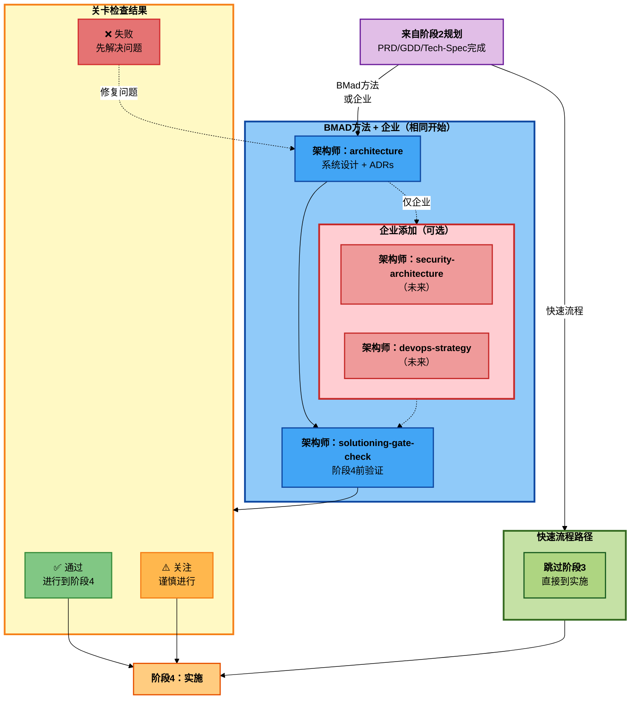

# BMM 解决方案设计工作流（阶段3）

**阅读时间：** 约8分钟

## 概览

阶段3（解决方案设计）工作流将**构建什么**（来自规划）转化为**如何构建**（技术设计）。此阶段通过在实施开始前记录架构决策来防止多史诗项目中的代理冲突。

**关键原则：** 使技术决策明确化并有文档记录，以便所有代理一致地实施。防止一个代理选择REST而另一个选择GraphQL。

**必需用于：** BMad方法（复杂项目）、企业方法

**可选用于：** BMad方法（简单项目）、快速流程（完全跳过）

---

## 阶段3解决方案设计工作流图谱



---

## 快速参考

| 工作流                   | 代理     | 轨道                    | 目的                                     |
| -------------------------- | --------- | ------------------------ | ------------------------------------------- |
| **architecture**           | 架构师 | BMad方法, 企业  | 技术架构和设计决策 |
| **solutioning-gate-check** | 架构师 | BMad复杂, 企业 | 验证规划/解决方案设计完整性  |

**何时跳过解决方案设计：**

- **快速流程：** 简单更改不需要架构 → 跳到阶段4

**何时解决方案设计是必需的：**

- **BMad方法：** 多史诗项目需要架构以防止冲突
- **企业：** 与BMad方法相同，加上在架构之后但在关卡检查之前添加的可选扩展工作流（测试架构、安全架构、devops策略）

---

## 为什么解决方案设计重要

### 没有解决方案设计的问题

```
代理1使用REST API实施史诗1
代理2使用GraphQL实施史诗2
结果：不一致的API设计，集成噩梦
```

### 有解决方案设计的解决方案

```
architecture工作流决定："所有API使用GraphQL"
所有代理遵循架构决策
结果：一致的实施，无冲突
```

### 解决方案设计 vs 规划

| 方面   | 规划（阶段2） | 解决方案设计（阶段3）    |
| -------- | ------------------ | ------------------------ |
| 问题 | 什么和为什么？      | 如何？                     |
| 输出   | 需求       | 技术设计         |
| 代理    | PM                 | 架构师                |
| 受众   | 利益相关者       | 开发人员               |
| 文档 | PRD/GDD            | 架构 + 技术规范 |
| 级别    | 业务逻辑     | 实施细节    |

---

## 工作流描述

### architecture

**目的：** 使技术决策明确化以防止代理冲突。生成针对AI一致性优化的决策聚焦架构文档。

**代理：** 架构师

**何时使用：**

- 多史诗项目（BMad复杂、企业）
- 横切技术关注点
- 多个代理实施不同部分
- 存在集成复杂性
- 技术选择需要对齐

**何时跳过：**

- 快速流程（简单更改）
- 具有直接技术栈的BMad方法简单项目
- 具有明确技术方法的单个史诗

**自适应对话方法：**

这不是模板填充器。架构工作流：

1. **通过对话发现**技术需求
2. **提出**带有权衡的架构选项
3. **记录**防止代理冲突的决策
4. **专注**于决策点，不是详尽文档

**关键输出：**

**architecture.md**包含：

1. **架构概览** - 系统上下文、原则、风格
2. **系统架构** - 高层图、组件交互、通信模式
3. **数据架构** - 数据库设计、状态管理、缓存、数据流
4. **API架构** - API风格（REST/GraphQL/gRPC）、认证、版本控制、错误处理
5. **前端架构**（如适用）- 框架、状态管理、组件架构、路由
6. **集成架构** - 第三方集成、消息队列、事件驱动模式
7. **安全架构** - 认证/授权、数据保护、安全边界
8. **部署架构** - 部署模型、CI/CD、环境策略、监控
9. **架构决策记录（ADRs）** - 带有上下文、选项、权衡、理由的关键决策
10. **史诗特定指导** - 每个史诗的技术说明、实施优先级、依赖关系
11. **标准和约定** - 目录结构、命名约定、代码组织、测试

**ADR格式（简要）：**

```markdown
## ADR-001：所有API使用GraphQL

**状态：** 已接受 | **日期：** 2025-11-02

**上下文：** PRD需要跨多个史诗的灵活查询

**决策：** 所有客户端-服务器通信使用GraphQL

**考虑的选项：**

1. REST - 熟悉但需要多个端点
2. GraphQL - 灵活查询，学习曲线
3. gRPC - 高性能，浏览器支持差

**理由：**

- PRD需要灵活数据获取（史诗1、3）
- 移动应用需要带宽优化（史诗2）
- 团队有GraphQL经验

**后果：**

- 正面：灵活查询，减少版本控制
- 负面：缓存复杂性，N+1查询风险
- 缓解：使用DataLoader进行批处理

**对史诗的影响：**

- 史诗1：用户管理 → GraphQL变更
- 史诗2：移动应用 → 优化查询
```

**示例：** 电商平台 → 单体 + PostgreSQL + Redis + Next.js + GraphQL，带有ADRs解释每个选择和史诗特定指导。

**集成：** 输入到阶段4（实施）。所有开发代理在实施期间参考架构。

---

### solutioning-gate-check

**目的：** 在阶段4实施前系统性地验证规划和解决方案设计是完整和一致的。确保PRD、架构和故事是内聚的，没有差距。

**代理：** 架构师

**何时使用：**

- **始终**在BMad复杂和企业项目的阶段4之前
- 架构工作流完成后
- 在sprint-planning工作流之前
- 当利益相关者请求就绪检查时

**何时跳过：**

- 快速流程（无解决方案设计）
- BMad简单（不需要关卡检查）

**关卡检查的目的：**

**防止：**

- ❌ 架构没有解决所有史诗
- ❌ 故事与架构决策冲突
- ❌ 需求模糊或矛盾
- ❌ 缺少关键依赖关系

**确保：**

- ✅ PRD → 架构 → 故事对齐
- ✅ 所有史诗都有明确的技术方法
- ✅ 无矛盾或差距
- ✅ 团队准备好实施

**检查标准：**

**PRD/GDD完整性：**

- 问题描述清晰和基于证据
- 成功指标已定义
- 用户人物画像已识别
- 功能需求完整
- 所有史诗已定义目标和目标
- 非功能需求（NFRs）已指定
- 风险和假设已记录

**架构完整性：**

- 系统架构已定义
- 数据架构已指定
- API架构已决定
- 关键ADRs已记录
- 安全架构已解决
- 史诗特定指导已提供
- 标准和约定已定义

**史诗/故事完整性：**

- 所有PRD功能已映射到故事
- 故事有验收标准
- 故事已优先排序（P0/P1/P2/P3）
- 依赖关系已识别
- 故事排序逻辑合理

**对齐检查：**

- 架构解决所有PRD需求
- 故事与架构决策对齐
- 史诗之间无矛盾
- NFRs有技术方法
- 集成点清晰

**关卡决策逻辑：**

**✅ 通过**

- 所有关键标准已满足
- 可接受有记录计划的次要差距
- **行动：** 进行到阶段4

**⚠️ 关注**

- 一些标准未满足但不是阻止因素
- 已识别差距并有清晰的解决路径
- **行动：** 谨慎进行，并行解决差距

**❌ 失败**

- 关键差距或矛盾
- 架构缺少关键决策
- 故事与PRD/架构冲突
- **行动：** 阻塞阶段4，先解决问题

**关键输出：**

**solutioning-gate-check.md**包含：

1. 执行摘要（通过/关注/失败）
2. 完整性评估（PRD、架构、史诗的分数）
3. 对齐评估（PRD↔架构、架构↔史诗、跨史诗一致性）
4. 质量评估（故事质量、依赖关系、风险）
5. 差距和建议（关键/次要差距、补救）
6. 带有理由的关卡决策
7. 下一步

**示例：** 电商平台 → 关注 ⚠️ 由于缺少安全架构和未定义的支付网关。建议：在继续之前完成安全部分并添加支付网关ADR。

---

## 与规划和实施的集成

### 规划 → 解决方案设计流程

**快速流程：**

```
规划（PM的tech-spec）
  → 跳过解决方案设计
  → 阶段4（实施）
```

**BMad方法：**

```
规划（PM的prd）
  → architecture（架构师）
  → solutioning-gate-check（架构师）
  → 阶段4（实施）
```

**企业：**

```
规划（PM的prd - 与BMad方法相同）
  → architecture（架构师）
  → 可选：security-architecture（架构师，未来）
  → 可选：devops-strategy（架构师，未来）
  → solutioning-gate-check（架构师）
  → 阶段4（实施）
```

**关于TEA（测试架构师）的说明：** TEA在所有阶段完全可操作，有8个工作流。TEA在阶段3审查期间验证架构可测试性，但没有专门的解决方案设计工作流。TEA的主要设置发生在阶段2（`*framework`、`*ci`、`*test-design`），测试执行在阶段4（`*atdd`、`*automate`、`*test-review`、`*trace`、`*nfr-assess`）。

**注意：** 企业使用与BMad方法相同的规划和架构。唯一区别是在架构之后但在关卡检查之前添加的可选扩展工作流。

### 解决方案设计 → 实施移交

**生成的文档：**

1. **architecture.md** → 在实施期间指导所有开发代理
2. **ADRs**（在架构中） → 代理引用以进行技术决策
3. **solutioning-gate-check.md** → 确认阶段4就绪

**实施如何使用解决方案设计：**

- **sprint-planning** - 加载架构以进行史诗排序
- **dev-story** - 引用架构决策和ADRs
- **code-review** - 验证代码遵循架构标准

---

## 最佳实践

### 1. 使决策明确化

不要让技术选择隐含化。在ADRs中记录带有理由的决策，以便代理理解上下文。

### 2. 专注于代理冲突

架构的主要工作是防止冲突的实施。专注于横切关注点。

### 3. 对关键决策使用ADRs

每个重要的技术选择都应该有一个ADR解释"为什么"，不仅仅是"什么"。

### 4. 保持实用性

不要过度架构化简单项目。BMad简单项目需要简单架构。

### 5. 在实施前运行关卡检查

在解决方案设计中捕获对齐问题比在实施中途发现它们快10倍。

### 6. 迭代架构

架构文档是活的。在实施期间学习时更新它们。

---

## 决策指南

### 快速流程

- **规划：** tech-spec（PM）
- **解决方案设计：** 完全跳过
- **实施：** sprint-planning → dev-story

### BMad方法

- **规划：** prd（PM）
- **解决方案设计：** architecture（架构师）→ solutioning-gate-check（架构师）
- **实施：** sprint-planning → epic-tech-context → dev-story

### 企业

- **规划：** prd（PM） - 与BMad方法相同
- **解决方案设计：** architecture（架构师）→ 可选扩展工作流（security-architecture、devops-strategy）→ solutioning-gate-check（架构师）
- **实施：** sprint-planning → epic-tech-context → dev-story

**关键差异：** 企业在架构之后但在关卡检查之前添加可选扩展工作流。其他一切都与BMad方法相同。

**注意：** TEA（测试架构师）跨所有阶段操作并验证架构可测试性，但不是阶段3特定的工作流。参见[测试架构指南](./test-architecture_zh.md)了解TEA的完整生命周期集成。

---

## 常见反模式

### ❌ 为复杂项目跳过架构

"架构拖慢我们，让我们直接开始编码。"
**结果：** 代理冲突、不一致设计、大量返工

### ❌ 过度工程化简单项目

"让我把这个简单功能设计成分布式系统。"
**结果：** 浪费时间、过度工程化、分析瘫痪

### ❌ 模板驱动架构

"填写这个架构模板的每个部分。"
**结果：** 文档戏，没有真正做出决策

### ❌ 跳过关卡检查

"PRD和架构看起来足够好，让我们开始。"
**结果：** 冲刺中途发现差距，浪费实施时间

### ✅ 正确方法

- 对BMad方法和企业都使用架构（两者都必需）
- 专注于决策，不是文档数量
- 企业：在架构之后添加可选扩展工作流（测试/安全/devops）
- 在实施前始终运行关卡检查

---

## 相关文档

- [阶段2：规划工作流](./workflows-planning_zh.md) - 上一阶段
- [阶段4：实施工作流](./workflows-implementation_zh.md) - 下一阶段
- [规模自适应系统](./scale-adaptive-system_zh.md) - 理解轨道
- [代理指南](./agents-guide_zh.md) - 完整代理参考

---

## 故障排除

**问：我总是需要架构吗？**
答：不。快速流程跳过它。BMad方法和企业都必需它。

**问：我怎么知道是否需要架构？**
答：如果您在规划（workflow-init）中选择了BMad方法或企业轨道，您需要架构以防止代理冲突。

**问：架构和tech-spec有什么区别？**
答：Tech-spec是针对简单更改的实施导向。架构是复杂多史诗项目的系统设计。

**问：我可以跳过关卡检查吗？**
答：只有快速流程可以。BMad方法和企业都需要在阶段4之前进行关卡检查。

**问：如果关卡检查失败怎么办？**
答：解决已识别的差距（缺少架构部分、冲突需求）并重新运行关卡检查。

**问：架构应该花费多长时间？**
答：BMad方法：架构1-2天。企业：总共2-3天（1-2天架构 + 0.5-1天可选扩展工作流）。如果花费更长时间，您可能过度文档化。

**问：ADRs需要完美吗？**
答：不。ADRs捕获带有理由的关键决策。它们应该简洁（每个ADR最多1页）。

**问：我可以在实施期间更新架构吗？**
答：可以！架构是活的。在您学习时更新它。对重大变更使用`correct-course`工作流。

---

_阶段3解决方案设计 - 实施前的技术决策。_