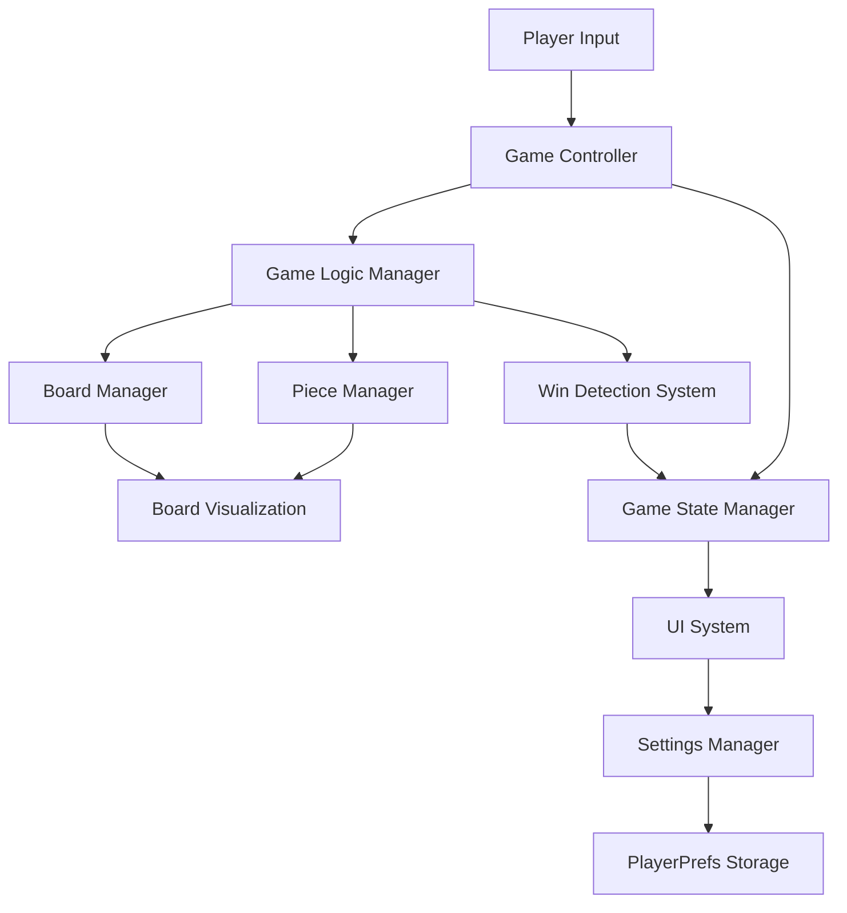
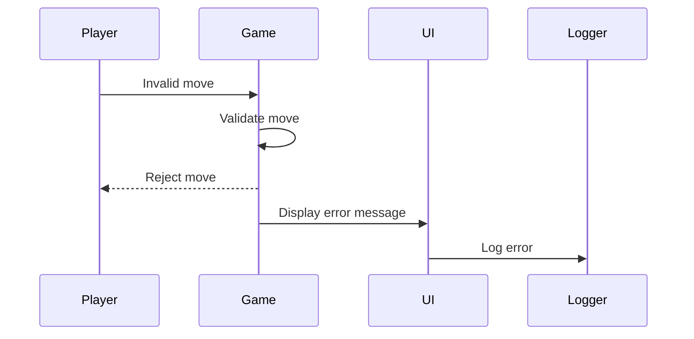

# Gomoku Game Fullstack Architecture Document

## Introduction

This document outlines the complete architecture for the Gomoku (Five in a Row) game, a Unity-based implementation focused on local two-player gameplay. The architecture is designed to provide a clean, intuitive gaming experience while maintaining the strategic depth of the classic board game.

The system will be built using Unity with C#, following best practices for game development. The architecture emphasizes modularity, testability, and maintainability while focusing on the core gameplay experience without unnecessary complexity.

### Starter Template or Existing Project

N/A - Greenfield project

### Change Log

| Date | Version | Description | Author |
|------|---------|-------------|--------|
| 2025-10-01 | 1.0 | Initial architecture document creation | Winston (Architect) |

## High Level Architecture

### Technical Summary

The Gomoku game is a Unity-based application designed for local two-player gameplay on the same device. The architecture follows a component-based design pattern typical of Unity games, with a clear separation between game logic, user interface, and data persistence layers.

The system implements a standard 15x15 Gomoku board by default, with support for alternative board sizes (9x9, 13x13, 19x19) and win conditions. The game features a clean, minimalist user interface that focuses on gameplay rather than complex menus or features.

Key architectural decisions include:
- Unity as the primary game engine for cross-platform compatibility
- Component-based architecture following Unity best practices
- Separation of game logic from presentation layer for testability
- PlayerPrefs for simple settings persistence
- Event-driven communication between components

### Platform and Infrastructure Choice

**Platform:** Unity Game Engine
**Key Services:** 
- Unity Engine for game rendering and input handling
- Unity Test Framework for automated testing
- PlayerPrefs for local data persistence
**Deployment Host and Regions:** Standalone application for Windows and macOS

Unity was selected as the platform due to:
- Strong 2D game development capabilities
- Cross-platform deployment (Windows, macOS)
- Built-in UI system (Unity UI Toolkit)
- Comprehensive testing framework
- Large community and extensive documentation

### Repository Structure

**Structure:** Standard Unity project structure with additional documentation
**Monorepo Tool:** N/A (Unity project structure)
**Package Organization:** 
- Unity Assets organized by functional areas (Scripts, Prefabs, Scenes, etc.)
- Documentation in docs/ directory following BMAD conventions
- Tests organized in Unity's test structure

### High Level Architecture Diagram



### Architectural Patterns

- **Component-Based Architecture:** Unity's native component system for game objects - _Rationale:_ Aligns with Unity best practices and promotes reusability
- **Event-Driven Architecture:** Events for communication between systems - _Rationale:_ Reduces coupling between components and improves testability
- **Singleton Pattern:** For managers that need global access - _Rationale:_ Provides easy access to shared systems while maintaining control
- **Observer Pattern:** For UI updates based on game state changes - _Rationale:_ Ensures UI reflects current game state without tight coupling

## Tech Stack

| Category | Technology | Version | Purpose | Rationale |
|----------|------------|---------|---------|-----------|
| Game Engine | Unity | 2022.3 LTS | Core game development platform | Industry standard for 2D games with cross-platform support |
| Primary Language | C# | .NET 4.x | Game logic implementation | Unity's native language with strong tooling support |
| UI Framework | Unity UI Toolkit | Latest | User interface development | Integrated with Unity, good performance for 2D UI |
| Testing Framework | Unity Test Framework | Latest | Unit and integration testing | Native to Unity, good integration with development workflow |
| Build System | Unity Build Pipeline | Latest | Application builds | Native to Unity, handles cross-platform deployment |
| Version Control | Git | Latest | Source control | Industry standard, good Unity integration |
| IDE | Visual Studio / Rider | Latest | Code development | Strong C# and Unity support |

## Data Models

### Game State

**Purpose:** Represents the current state of the game including board state, player turns, and game status.

**Key Attributes:**
- BoardState: int[,] - 2D array representing the game board
- CurrentPlayer: int - Identifier for the current player (1 or 2)
- GameStatus: enum - Current game status (Playing, Won, Draw)
- BoardSize: int - Current board dimensions

### Player

**Purpose:** Represents a player in the game with their properties.

**Key Attributes:**
- PlayerId: int - Unique identifier for the player
- PlayerName: string - Display name for the player
- PieceType: int - Type of piece the player uses (1 for black, 2 for white)
- Score: int - Player's current score

### Settings

**Purpose:** Stores user preferences and game settings.

**Key Attributes:**
- BoardSize: int - Preferred board size (9, 13, 15, 19)
- Theme: string - Selected visual theme
- WinCondition: int - Number of pieces in a row needed to win
- LastPlayed: DateTime - Timestamp of last game

## Frontend Architecture

### Component Architecture

#### Component Organization

```
Assets/
├── Scripts/
│   ├── Core/                 # Core game logic
│   │   ├── GameManager.cs
│   │   ├── BoardManager.cs
│   │   ├── PieceManager.cs
│   │   └── WinDetector.cs
│   ├── UI/                   # User interface components
│   │   ├── UIManager.cs
│   │   ├── MenuController.cs
│   │   ├── GameUI.cs
│   │   └── SettingsUI.cs
│   ├── Utilities/            # Helper classes
│   │   ├── EventManager.cs
│   │   └── PlayerPrefsManager.cs
│   └── Tests/                # Game tests
│       ├── UnitTests/
│       └── IntegrationTests/
├── Prefabs/                  # Reusable game objects
├── Scenes/                   # Game scenes
└── Resources/                # Game assets
```

#### Component Template

```csharp
using UnityEngine;

public class ComponentTemplate : MonoBehaviour
{
    // Public variables for inspector configuration
    [SerializeField] private SomeComponent dependency;
    
    // Private variables
    private SomeData data;
    
    // Unity lifecycle methods
    private void Awake()
    {
        Initialize();
    }
    
    // Public methods for external interaction
    public void DoSomething()
    {
        // Implementation
    }
    
    // Private helper methods
    private void Initialize()
    {
        // Initialization logic
    }
}
```

### State Management Architecture

#### State Structure

```csharp
public enum GameState
{
    MainMenu,
    Playing,
    Paused,
    GameOver
}

public class GameStateManager : MonoBehaviour
{
    public static GameStateManager Instance { get; private set; }
    
    [SerializeField] private GameState currentState;
    
    public GameState CurrentState => currentState;
    
    public event System.Action<GameState> OnGameStateChanged;
    
    private void Awake()
    {
        if (Instance == null)
        {
            Instance = this;
            DontDestroyOnLoad(gameObject);
        }
        else
        {
            Destroy(gameObject);
        }
    }
    
    public void ChangeState(GameState newState)
    {
        currentState = newState;
        OnGameStateChanged?.Invoke(newState);
    }
}
```

#### State Management Patterns

- **Singleton Pattern:** For global state managers
- **Event-Driven Updates:** For state change notifications
- **ScriptableObject Configuration:** For static configuration data

### Routing Architecture

#### Route Organization

In Unity, "routing" is managed through scenes and UI panels:

```
Scenes/
├── MainMenu.unity
├── GameScene.unity
└── SettingsScene.unity

UI Panels (within scenes):
├── MainMenuPanel
├── GamePanel
├── SettingsPanel
└── PausePanel
```

#### Protected Route Pattern

```csharp
public class SceneController : MonoBehaviour
{
    public void LoadScene(string sceneName)
    {
        // Check if scene can be loaded based on game state
        if (CanLoadScene(sceneName))
        {
            UnityEngine.SceneManagement.SceneManager.LoadScene(sceneName);
        }
        else
        {
            // Handle unauthorized scene access
            Debug.LogWarning($"Cannot load scene {sceneName} in current state");
        }
    }
    
    private bool CanLoadScene(string sceneName)
    {
        // Implement scene access logic based on game state
        return true;
    }
}
```

### Frontend Services Layer

#### API Client Setup

For a local game, there's no external API, but we have internal service classes:

```csharp
public class GameService : MonoBehaviour
{
    private static GameService _instance;
    public static GameService Instance => _instance;
    
    private void Awake()
    {
        if (_instance == null)
        {
            _instance = this;
            DontDestroyOnLoad(gameObject);
        }
        else
        {
            Destroy(gameObject);
        }
    }
    
    public void StartNewGame(int boardSize)
    {
        // Implementation
    }
    
    public bool PlacePiece(int x, int y, int player)
    {
        // Implementation
        return true;
    }
    
    public int CheckWinCondition(int[,] board)
    {
        // Implementation
        return 0;
    }
}
```

#### Service Example

```csharp
public class SettingsService : MonoBehaviour
{
    private const string BOARD_SIZE_KEY = "BoardSize";
    private const string THEME_KEY = "Theme";
    
    public void SaveBoardSize(int size)
    {
        PlayerPrefs.SetInt(BOARD_SIZE_KEY, size);
        PlayerPrefs.Save();
    }
    
    public int LoadBoardSize()
    {
        return PlayerPrefs.GetInt(BOARD_SIZE_KEY, 15); // Default to 15x15
    }
    
    public void SaveTheme(string theme)
    {
        PlayerPrefs.SetString(THEME_KEY, theme);
        PlayerPrefs.Save();
    }
    
    public string LoadTheme()
    {
        return PlayerPrefs.GetString(THEME_KEY, "Default");
    }
}
```

## Backend Architecture

Since this is a local Unity game, there is no traditional backend. All game logic runs on the client device.

### Service Architecture

#### Traditional Server Architecture

Not applicable for local game.

### Database Architecture

#### Schema Design

Not applicable for local game using PlayerPrefs.

#### Data Access Layer

```csharp
public class DataRepository
{
    public void SaveSettings(GameSettings settings)
    {
        PlayerPrefs.SetInt("BoardSize", settings.BoardSize);
        PlayerPrefs.SetString("Theme", settings.Theme);
        PlayerPrefs.SetInt("WinCondition", settings.WinCondition);
        PlayerPrefs.Save();
    }
    
    public GameSettings LoadSettings()
    {
        var settings = new GameSettings
        {
            BoardSize = PlayerPrefs.GetInt("BoardSize", 15),
            Theme = PlayerPrefs.GetString("Theme", "Default"),
            WinCondition = PlayerPrefs.GetInt("WinCondition", 5)
        };
        return settings;
    }
}
```

### Authentication and Authorization

Not applicable for local game.

## Unified Project Structure

```
GomokuGame/
├── Assets/                     # Unity assets
│   ├── Scenes/                 # Game scenes
│   ├── Scripts/                # C# scripts
│   │   ├── Core/               # Core game logic
│   │   ├── UI/                 # User interface
│   │   ├── Utilities/          # Helper classes
│   │   └── Tests/              # Game tests
│   ├── Prefabs/                # Reusable game objects
│   ├── Materials/              # Visual materials
│   ├── Textures/               # Image assets
│   └── Resources/              # Runtime loaded assets
├── Packages/                   # Unity package dependencies
├── ProjectSettings/            # Unity project configuration
├── docs/                       # Documentation
│   ├── prd.md                  # Product requirements
│   ├── architecture.md         # Architecture document
│   ├── stories/                # User stories
│   └── qa/                     # Quality assurance
├── .gitignore                  # Git ignore rules
├── README.md                   # Project README
└── LICENSE                     # License information
```

## Development Workflow

### Local Development Setup

#### Prerequisites

```bash
# Install Unity Hub
# Install Unity 2022.3 LTS or later
# Ensure Unity Test Framework is available
```

#### Initial Setup

```bash
# Clone repository
git clone <repository-url>
cd GomokuGame

# Open project in Unity
# Unity will automatically import assets
```

#### Development Commands

```bash
# Unity handles builds through its editor
# Tests can be run through Unity Test Runner
# No command line build process for basic development
```

### Environment Configuration

#### Required Environment Variables

Unity games don't typically use environment variables, but settings are stored in:

```
# Unity Player Preferences (automatically managed)
BoardSize = 15
Theme = "Default"
WinCondition = 5
```

## Deployment Architecture

### Deployment Strategy

**Frontend Deployment:**
- **Platform:** Standalone application
- **Build Command:** Unity Build Settings
- **Output Directory:** Builds/
- **CDN/Edge:** N/A

**Backend Deployment:**
- **Platform:** N/A
- **Build Command:** N/A
- **Deployment Method:** N/A

### CI/CD Pipeline

```yaml
# Unity CI/CD would typically be configured through Unity Cloud or custom solutions
# Basic structure for a Unity build pipeline:

name: Build and Test

on:
  push:
    branches: [ main ]
  pull_request:
    branches: [ main ]

jobs:
  test:
    runs-on: ubuntu-latest
    steps:
    - uses: actions/checkout@v2
    - name: Run tests
      run: echo "Run Unity tests through Unity Editor"
  
  build:
    runs-on: ubuntu-latest
    needs: test
    steps:
    - uses: actions/checkout@v2
    - name: Build game
      run: echo "Build Unity game for target platforms"
```

### Environments

| Environment | Frontend URL | Backend URL | Purpose |
|-------------|--------------|-------------|---------|
| Development | Local Unity Editor | N/A | Local development |
| Staging | N/A | N/A | Pre-release testing |
| Production | Standalone executable | N/A | Live distribution |

## Security and Performance

### Security Requirements

**Frontend Security:**
- CSP Headers: N/A (Standalone application)
- XSS Prevention: N/A (No web content)
- Secure Storage: PlayerPrefs with obfuscation for sensitive data

**Backend Security:**
- N/A (No backend)

**Authentication Security:**
- N/A (No authentication)

### Performance Optimization

**Frontend Performance:**
- Bundle Size Target: Optimized Unity build
- Loading Strategy: Scene-based loading
- Caching Strategy: Object pooling for game pieces

**Backend Performance:**
- N/A (No backend)

## Testing Strategy

### Testing Pyramid

```
    Manual Playtesting
         /     \
Integration Tests   Unit Tests
```

### Test Organization

#### Frontend Tests

```
Assets/Scripts/Tests/
├── UnitTests/
│   ├── BoardManagerTests.cs
│   ├── WinDetectorTests.cs
│   └── GameManagerTests.cs
└── IntegrationTests/
    ├── GameFlowTests.cs
    └── UISystemTests.cs
```

#### Backend Tests

N/A for local game.

#### E2E Tests

```
Assets/Scripts/Tests/
└── IntegrationTests/
    ├── FullGameplayTests.cs
    └── SettingsPersistenceTests.cs
```

### Test Examples

#### Frontend Component Test

```csharp
using NUnit.Framework;
using UnityEngine;
using UnityEngine.TestTools;

public class BoardManagerTests
{
    [Test]
    public void PlacePiece_ValidPosition_PiecePlaced()
    {
        // Arrange
        var boardManager = new BoardManager();
        boardManager.Initialize(15);
        
        // Act
        bool result = boardManager.PlacePiece(7, 7, 1);
        
        // Assert
        Assert.IsTrue(result);
        Assert.AreEqual(1, boardManager.GetPieceAt(7, 7));
    }
}
```

#### Backend API Test

N/A for local game.

#### E2E Test

```csharp
using NUnit.Framework;
using UnityEngine.TestTools;
using System.Collections;

public class FullGameplayTests
{
    [UnityTest]
    public IEnumerator FullGame_WinCondition_MatchResult()
    {
        // Arrange
        // Setup game scene
        
        // Act
        // Simulate full game to win condition
        
        // Assert
        // Verify win is detected correctly
        
        yield return null;
    }
}
```

## Coding Standards

### Critical Fullstack Rules

- **Separation of Concerns:** Keep game logic separate from UI rendering
- **Event-Driven Communication:** Use events for inter-component communication
- **Singleton Pattern:** Use sparingly and only for legitimate global managers
- **Testability:** Design components to be easily testable
- **Performance:** Profile regularly and optimize critical paths

### Naming Conventions

| Element | Frontend | Backend | Example |
|---------|----------|---------|---------|
| Components | PascalCase | N/A | `BoardManager.cs` |
| Methods | PascalCase | N/A | `PlacePiece()` |
| Variables | camelCase | N/A | `currentPlayer` |
| Classes | PascalCase | N/A | `GameManager` |

## Error Handling Strategy

### Error Flow



### Error Response Format

```csharp
public class GameError
{
    public string ErrorCode { get; set; }
    public string Message { get; set; }
    public System.DateTime Timestamp { get; set; }
}
```

### Frontend Error Handling

```csharp
public class ErrorHandler
{
    public static void HandleError(string errorCode, string message)
    {
        Debug.LogError($"[{errorCode}] {message}");
        // Display user-friendly message
        UIManager.Instance.ShowErrorMessage(message);
        // Log for analytics
        AnalyticsService.LogError(errorCode, message);
    }
}
```

### Backend Error Handling

N/A for local game.

## Monitoring and Observability

### Monitoring Stack

- **Frontend Monitoring:** Unity Profiler for performance monitoring
- **Backend Monitoring:** N/A
- **Error Tracking:** Unity Analytics or custom error logging
- **Performance Monitoring:** Unity Profiler

### Key Metrics

**Frontend Metrics:**
- Frame rate during gameplay
- Memory usage
- Load times
- User interactions

**Backend Metrics:**
- N/A

## Checklist Results Report

To be completed after architecture review and refinement.