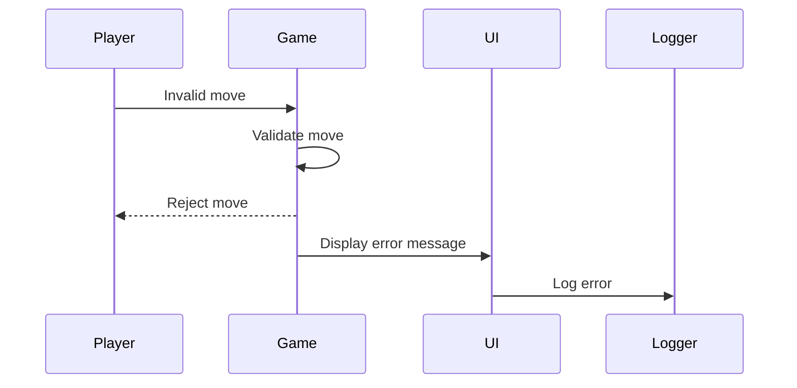

# Error Handling Strategy

## Error Flow



## Error Response Format

```csharp
public class GameError
{
    public string ErrorCode { get; set; }
    public string Message { get; set; }
    public System.DateTime Timestamp { get; set; }
}
```

## Frontend Error Handling

```csharp
public class ErrorHandler
{
    public static void HandleError(string errorCode, string message)
    {
        Debug.LogError($"[{errorCode}] {message}");
        // Display user-friendly message
        UIManager.Instance.ShowErrorMessage(message);
        // Log for analytics
        AnalyticsService.LogError(errorCode, message);
    }
}
```

## Backend Error Handling

N/A for local game.
