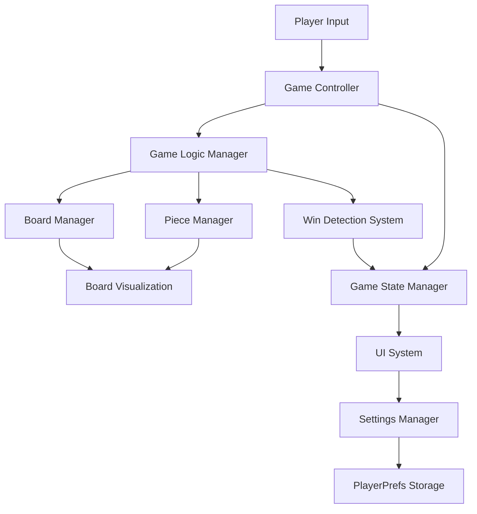

# High Level Architecture

## Technical Summary

The Gomoku game is a Unity-based application designed for local two-player gameplay on the same device. The architecture follows a component-based design pattern typical of Unity games, with a clear separation between game logic, user interface, and data persistence layers.

The system implements a standard 15x15 Gomoku board by default, with support for alternative board sizes (9x9, 13x13, 19x19) and win conditions. The game features a clean, minimalist user interface that focuses on gameplay rather than complex menus or features.

Key architectural decisions include:
- Unity as the primary game engine for cross-platform compatibility
- Component-based architecture following Unity best practices
- Separation of game logic from presentation layer for testability
- PlayerPrefs for simple settings persistence
- Event-driven communication between components

## Platform and Infrastructure Choice

**Platform:** Unity Game Engine
**Key Services:** 
- Unity Engine for game rendering and input handling
- Unity Test Framework for automated testing
- PlayerPrefs for local data persistence
**Deployment Host and Regions:** Standalone application for Windows and macOS

Unity was selected as the platform due to:
- Strong 2D game development capabilities
- Cross-platform deployment (Windows, macOS)
- Built-in UI system (Unity UI Toolkit)
- Comprehensive testing framework
- Large community and extensive documentation

## Repository Structure

**Structure:** Standard Unity project structure with additional documentation
**Monorepo Tool:** N/A (Unity project structure)
**Package Organization:** 
- Unity Assets organized by functional areas (Scripts, Prefabs, Scenes, etc.)
- Documentation in docs/ directory following BMAD conventions
- Tests organized in Unity's test structure

## High Level Architecture Diagram

## Architectural Patterns

- **Component-Based Architecture:** Unity's native component system for game objects - _Rationale:_ Aligns with Unity best practices and promotes reusability
- **Event-Driven Architecture:** Events for communication between systems - _Rationale:_ Reduces coupling between components and improves testability
- **Singleton Pattern:** For managers that need global access - _Rationale:_ Provides easy access to shared systems while maintaining control
- **Observer Pattern:** For UI updates based on game state changes - _Rationale:_ Ensures UI reflects current game state without tight coupling
