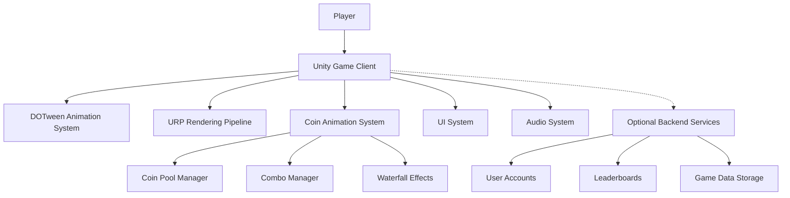
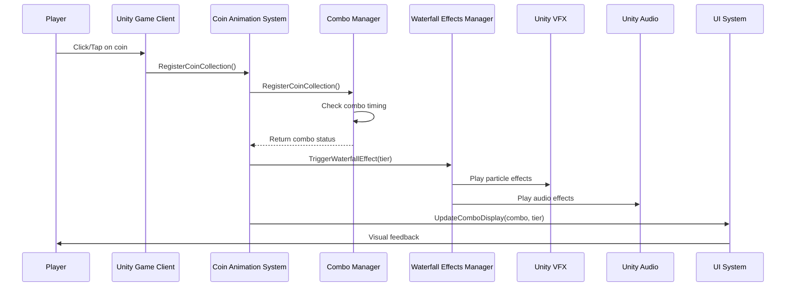
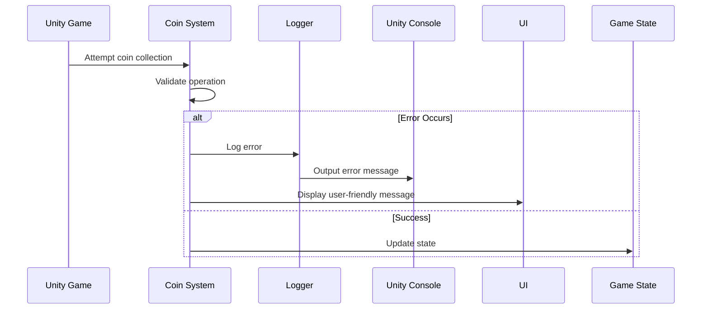

# Unity Coin Collection Game with Waterfall Effects Fullstack Architecture Document

## Introduction

This document outlines the complete architecture for the Unity coin collection game with waterfall effects, including the Unity frontend implementation and any backend services required. It serves as the single source of truth for development, ensuring consistency across the entire technology stack.

This unified approach combines what would traditionally be separate frontend and backend architecture documents, streamlining the development process for this Unity-based game where the frontend is the primary application and backend services support game data and user accounts.

### Starter Template or Existing Project
N/A - Unity game project using existing DOTween and URP implementations

### Change Log
| Date | Version | Description | Author |
|------|---------|-------------|--------|
| 2025-09-20 | 1.0 | Initial architecture document creation | Winston (Architect) |

## High Level Architecture

### Technical Summary
The Unity coin collection game is a client-side application built with Unity 2022+ that implements enhanced coin collection mechanics with waterfall effects. The architecture follows a client-server model where the Unity application serves as the primary frontend with optional backend services for user accounts, leaderboards, and game data persistence. The system uses DOTween for animations and URP for rendering, with object pooling for performance optimization. The architecture achieves PRD goals by implementing cascading coin effects, tiered intensity levels, and natural acceleration patterns while maintaining 60+ FPS performance on target devices.

### Platform and Infrastructure Choice
**Platform:** Unity with optional cloud services
**Key Services:**
- Unity Engine (Primary platform)
- DOTween (Animation library)
- URP (Universal Render Pipeline)
- Optional: Unity Gaming Services for leaderboards and cloud saves
**Deployment Host and Regions:** Cross-platform deployment (PC, mobile, WebGL) with optional Unity Cloud hosting

### Repository Structure
**Structure:** Unity project structure with modular script organization
**Monorepo Tool:** N/A (Unity project structure)
**Package Organization:**
- Assets/Scripts/CoinAnimation/ (Core coin animation system)
- Assets/Scripts/ (Other game systems)
- Assets/Prefabs/ (Reusable game objects)
- Assets/Scenes/ (Game scenes)
- Assets/Resources/ (Game assets)

### High Level Architecture Diagram


### Architectural Patterns
- **Component-Based Architecture:** Unity's component system with GameObjects and MonoBehaviours
- **Object Pooling Pattern:** Reuse coin objects and effects to optimize performance
- **Singleton Pattern:** Centralized managers for coin animation, combo tracking, and effects
- **Observer Pattern:** Event-driven communication between systems
- **State Machine Pattern:** Combo tier levels and effect states

## Tech Stack

### Technology Stack Table
| Category | Technology | Version | Purpose | Rationale |
|----------|------------|---------|---------|-----------|
| Game Engine | Unity | 2022+ | Primary development platform | Industry standard for cross-platform game development |
| Animation | DOTween | Latest | Tweening and animation | Industry-leading animation library for Unity |
| Rendering | URP | Latest | Universal Render Pipeline | Modern rendering pipeline with good performance |
| Scripting Language | C# | Latest | Game logic implementation | Native Unity scripting language |
| Physics | Unity Physics | Built-in | Game physics simulation | Integrated with Unity engine |
| UI System | Unity UI | Built-in | User interface | Native Unity UI system |
| Particle System | Unity VFX | Built-in | Visual effects | Integrated particle system |
| Audio | Unity Audio | Built-in | Sound effects and music | Native Unity audio system |
| Testing | Unity Test Framework | Latest | Unit and integration testing | Native Unity testing framework |
| Performance Monitoring | Custom/Unity Profiler | Built-in | Performance analysis | Integrated profiling tools |
| Build System | Unity Build Pipeline | Built-in | Game builds | Native Unity build system |
| Version Control | Git | Latest | Source control | Industry standard version control |
| IDE | Visual Studio/Unity Editor | Latest | Development environment | Standard Unity development tools |

## Data Models

### Coin Collection Data
**Purpose:** Track player coin collections, combos, and achievements

**Key Attributes:**
- coinCount: int - Total coins collected
- comboCount: int - Current combo streak
- comboTier: enum - Current combo tier (Bronze, Silver, Gold, Platinum)
- highestCombo: int - Player's highest combo achieved
- achievements: array - List of unlocked achievements

### TypeScript Interface
```typescript
interface CoinCollectionData {
  coinCount: number;
  comboCount: number;
  comboTier: 'Bronze' | 'Silver' | 'Gold' | 'Platinum';
  highestCombo: number;
  achievements: string[];
  lastCollectionTime: number;
}
```

### Relationships
- None (standalone game data)

### Player Profile Data
**Purpose:** Store player preferences and settings

**Key Attributes:**
- playerId: string - Unique player identifier
- playerName: string - Player's display name
- settings: object - Game settings and preferences
- highScores: array - Player's best scores
- unlockedEffects: array - Visual effects the player has unlocked

### TypeScript Interface
```typescript
interface PlayerProfile {
  playerId: string;
  playerName: string;
  settings: {
    qualityLevel: number;
    soundVolume: number;
    musicVolume: number;
    vibrationEnabled: boolean;
  };
  highScores: number[];
  unlockedEffects: string[];
}
```

### Relationships
- PlayerProfile contains CoinCollectionData

## Components

### Coin Animation System
**Responsibility:** Manage all coin animation logic including flying effects, cascading, and waterfall physics

**Key Interfaces:**
- SpawnCoinAnimation(Vector3 start, Vector3 end)
- SpawnCoinBurst(Vector3 center, int count, float radius)
- RegisterCoinCollection()

**Dependencies:** DOTween, URP, Coin Pool Manager

**Technology Stack:** C#, Unity Engine, DOTween

### Combo Manager
**Responsibility:** Track combo streaks, manage tier levels, and trigger combo-based effects

**Key Interfaces:**
- RegisterCoinCollection()
- GetCurrentCombo()
- GetComboTier()
- ResetCombo()

**Dependencies:** Coin Animation System

**Technology Stack:** C#, Unity Engine

### Waterfall Effects Manager
**Responsibility:** Create and manage waterfall visual and audio effects based on combo tiers

**Key Interfaces:**
- TriggerWaterfallEffect(ComboTier tier)
- UpdateEffectIntensity(float intensity)
- PlayWaterfallAudio(ComboTier tier)

**Dependencies:** Unity Particle System, Unity Audio System

**Technology Stack:** C#, Unity Engine, Unity VFX

### UI System
**Responsibility:** Display game information, combo counters, and player feedback

**Key Interfaces:**
- UpdateComboDisplay(int combo, ComboTier tier)
- ShowAchievementUnlock(string achievement)
- UpdateCoinCounter(int coins)

**Dependencies:** Unity UI System

**Technology Stack:** C#, Unity Engine, Unity UI

### Coin Pool Manager
**Responsibility:** Manage object pooling for coin objects to optimize performance

**Key Interfaces:**
- GetCoin(): Coin
- ReturnCoin(Coin coin)
- InitializePool(int size)

**Dependencies:** Coin prefab

**Technology Stack:** C#, Unity Engine

## Core Workflows

### Coin Collection Workflow


## Frontend Architecture

### Component Architecture

#### Component Organization
```
Assets/
├── Scripts/
│   ├── CoinAnimation/
│   │   ├── Coin.cs
│   │   ├── CoinPoolManager.cs
│   │   ├── CoinAnimationSystem.cs
│   │   ├── ComboManager.cs
│   │   ├── ComboEffectsManager.cs
│   │   ├── ComboAudioManager.cs
│   │   └── ComboUIDisplay.cs
│   ├── UI/
│   │   ├── UIManager.cs
│   │   └── HUD.cs
│   └── Core/
│       ├── GameManager.cs
│       └── AudioManager.cs
├── Prefabs/
│   └── Coin.prefab
└── Scenes/
    └── MainGame.unity
```

### State Management Architecture

#### State Structure
```typescript
interface GameState {
  coinCount: number;
  combo: {
    current: number;
    tier: 'Bronze' | 'Silver' | 'Gold' | 'Platinum';
    timeLeft: number;
  };
  effects: {
    waterfallActive: boolean;
    currentIntensity: number;
  };
  ui: {
    visible: boolean;
    coinCounter: number;
    comboDisplay: string;
  };
}
```

#### State Management Patterns
- Singleton pattern for GameManager
- Event-driven state updates
- Observer pattern for UI updates

### Routing Architecture
N/A - Single scene game

### Frontend Services Layer

#### API Client Setup
N/A - Client-side only game (unless backend services are added)

#### Service Example
```csharp
public class CoinCollectionService {
    public void CollectCoin(Coin coin) {
        // Handle coin collection logic
        CoinAnimationSystem.Instance.RegisterCoinCollection();
        // Update game state
        GameManager.Instance.AddCoin();
    }
}
```

## Backend Architecture
N/A - Client-side game with optional Unity Gaming Services

## Unified Project Structure
```
UnityProject/
├── Assets/
│   ├── Scenes/
│   │   └── MainGame.unity
│   ├── Scripts/
│   │   ├── Core/
│   │   │   ├── GameManager.cs
│   │   │   └── AudioManager.cs
│   │   ├── CoinAnimation/
│   │   │   ├── Coin.cs
│   │   │   ├── CoinPoolManager.cs
│   │   │   ├── CoinAnimationSystem.cs
│   │   │   ├── ComboManager.cs
│   │   │   ├── ComboEffectsManager.cs
│   │   │   ├── ComboAudioManager.cs
│   │   │   └── ComboUIDisplay.cs
│   │   └── UI/
│   │       ├── UIManager.cs
│   │       └── HUD.cs
│   ├── Prefabs/
│   │   └── Coin.prefab
│   ├── Resources/
│   │   └── icon02.png
│   ├── Materials/
│   ├── Shaders/
│   ├── Particles/
│   │   └── ComboEffects/
│   └── Audio/
├── ProjectSettings/
├── Packages/
├── docs/
│   ├── game-prd.md
│   └── fullstack-architecture.md
└── README.md
```

## Development Workflow

### Local Development Setup

#### Prerequisites
```bash
# Unity Hub with Unity 2022+ installed
# Visual Studio or preferred IDE
# Git for version control
```

#### Initial Setup
```bash
# Clone repository
git clone <repository-url>
# Open UnityProject in Unity Hub
# Install DOTween package via Package Manager
# Install URP package via Package Manager
```

#### Development Commands
```bash
# Start Unity Editor
Unity.exe -projectPath ./UnityProject

# Run tests
# In Unity Editor: Window > General > Test Runner > Run All Tests

# Build game
# In Unity Editor: File > Build Settings > Build
```

### Environment Configuration

#### Required Environment Variables
```bash
# Unity Editor preferences are stored in the Editor
# No external environment variables required for basic functionality
# Optional Unity Gaming Services configuration in Unity Editor
```

## Deployment Architecture

### Deployment Strategy
**Frontend Deployment:**
- **Platform:** Unity Build Pipeline
- **Build Command:** File > Build Settings > Build
- **Output Directory:** Builds/
- **CDN/Edge:** N/A for standalone builds

**Backend Deployment:**
- **Platform:** N/A (client-side only)
- **Build Command:** N/A
- **Deployment Method:** N/A

### Environments
| Environment | Frontend URL | Backend URL | Purpose |
|-------------|--------------|-------------|---------|
| Development | Local Unity Editor | N/A | Local development |
| Production | Standalone builds | N/A | Player distribution |

## Security and Performance

### Security Requirements
**Frontend Security:**
- CSP Headers: N/A (standalone application)
- XSS Prevention: N/A (no web content)
- Secure Storage: PlayerPrefs for local data storage

**Backend Security:**
- N/A (client-side only)

**Authentication Security:**
- N/A (no authentication required for basic gameplay)

### Performance Optimization
**Frontend Performance:**
- Bundle Size Target: Optimized Unity build
- Loading Strategy: Object pooling for coins and effects
- Caching Strategy: In-memory caching of frequently used objects

**Backend Performance:**
- N/A (client-side only)

## Testing Strategy

### Testing Pyramid
```
Manual Playtesting
/                \
Integration Tests  Unit Tests
/                    \
Unity Test Framework   Individual Component Tests
```

### Test Organization

#### Frontend Tests
```
UnityProject/
└── Assets/
    └── Tests/
        ├── UnitTests/
        │   ├── CoinTests.cs
        │   ├── ComboTests.cs
        │   └── PoolTests.cs
        └── IntegrationTests/
            ├── AnimationTests.cs
            └── EffectTests.cs
```

#### Backend Tests
N/A (client-side only)

#### E2E Tests
N/A (manual playtesting for game mechanics)

### Test Examples

#### Frontend Component Test
```csharp
[Test]
public void CoinCollection_IncreasesCombo() {
    // Arrange
    var coin = new GameObject().AddComponent<Coin>();
    var comboManager = ComboManager.Instance;
    int initialCombo = comboManager.GetCurrentCombo();

    // Act
    coin.Collect();

    // Assert
    Assert.Greater(comboManager.GetCurrentCombo(), initialCombo);
}
```

#### Backend API Test
N/A (client-side only)

#### E2E Test
Manual playtesting procedure for combo mechanics and waterfall effects.

## Coding Standards

### Critical Fullstack Rules
- **Component Organization:** Keep related scripts in appropriately named folders
- **Object Pooling:** Always use CoinPoolManager for coin objects
- **Animation Cleanup:** Properly cleanup DOTween sequences to prevent memory leaks
- **Performance Monitoring:** Use PerformanceMonitor.cs for performance tracking
- **Code Documentation:** Document all public methods with XML comments

### Naming Conventions
| Element | Frontend | Backend | Example |
|---------|----------|---------|---------|
| Components | PascalCase | - | `CoinAnimationSystem.cs` |
| Methods | PascalCase | - | `SpawnCoinAnimation()` |
| Variables | camelCase | - | `coinCount` |
| Classes | PascalCase | - | `ComboManager` |

## Error Handling Strategy

### Error Flow


### Error Response Format
N/A (client-side only, errors displayed to user directly)

### Frontend Error Handling
```csharp
public class CoinAnimationSystem : MonoBehaviour {
    private void HandleError(string message) {
        Debug.LogError($"Coin Animation Error: {message}");
        // Optionally display user-friendly message
        UIManager.Instance.ShowErrorMessage(message);
    }
}
```

### Backend Error Handling
N/A (client-side only)

## Monitoring and Observability

### Monitoring Stack
- **Frontend Monitoring:** Unity Profiler for performance monitoring
- **Backend Monitoring:** N/A
- **Error Tracking:** Unity Console and custom logging
- **Performance Monitoring:** PerformanceMonitor.cs script

### Key Metrics
**Frontend Metrics:**
- Frame rate (target 60+ FPS)
- Memory usage
- Animation performance
- Object pool efficiency

**Backend Metrics:**
- N/A (client-side only)