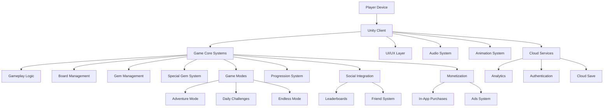
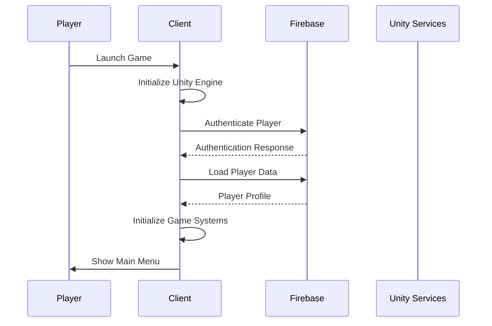
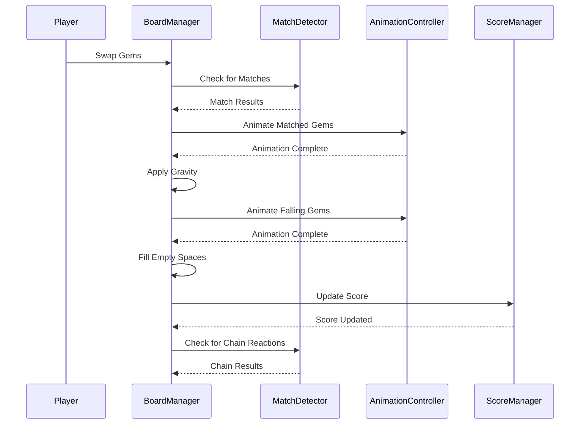

# Match-3 Game Architecture Document

## 1. Introduction

This document outlines the overall project architecture for the Match-3 mobile game, including backend systems, shared services, and non-UI specific concerns. Its primary goal is to serve as the guiding architectural blueprint for development, ensuring consistency and adherence to chosen patterns and technologies.

**Relationship to Frontend Architecture:**
This document focuses on the core game systems and backend services. A separate Frontend Architecture Document will detail the UI/UX specific design and MUST be used in conjunction with this document. Core technology stack choices documented herein are definitive for the entire project, including frontend components.

### 1.1 Starter Template or Existing Project
N/A - This is a greenfield project built from scratch using Unity 2021.3 LTS.

### 1.2 Change Log
| Date | Version | Description | Author |
|------|---------|-------------|--------|
| 2025-09-18 | 1.0.0 | Initial architecture document | Dan (Game Architect) |

## 2. High Level Architecture

### 2.1 Technical Summary
The Match-3 game is a mobile puzzle game built with Unity 2021.3 LTS for iOS and Android platforms. The architecture follows a component-based design leveraging Unity's Entity-Component-System (ECS) patterns where appropriate. The core gameplay logic is implemented in C# with performance-critical systems optimized for mobile devices. The game features three primary modes (Adventure, Daily Challenges, and Endless) with social integration, monetization systems, and cloud-based progression.

### 2.2 High Level Overview
- **Architectural Style:** Component-based architecture with Unity ECS for performance-critical systems
- **Repository Structure:** Mono-repo containing all game assets, code, and configurations
- **Service Architecture:** Client-only architecture with cloud services integration for analytics, social features, and monetization
- **User Interaction Flow:** Direct touch-based interaction with server communication for social features and progression
- **Key Architectural Decisions:** 
  - Unity as the primary game engine for cross-platform deployment
  - DOTween for animation systems (as demonstrated in coin animation documentation)
  - Object pooling for performance optimization of gems and effects
  - Modular design for game modes and features

### 2.3 High Level Project Diagram


### 2.4 Architectural and Design Patterns
- **Component-Based Architecture:** Using Unity's component system for modular, reusable game objects
- **Object Pooling:** For efficient management of gems, particles, and visual effects
- **State Machine Pattern:** For game state management (Menu, Playing, Paused, Game Over)
- **Observer Pattern:** For event-driven communication between systems
- **Command Pattern:** For input handling and replay systems
- **Singleton Pattern:** For manager classes that need global access (with careful use)

## 3. Tech Stack

### 3.1 Cloud Infrastructure
- **Provider:** Multiple (Google Play Services for Android, Game Center for iOS, custom backend for cross-platform features)
- **Key Services:** Firebase for analytics, authentication, and cloud save; Unity Gaming Services for IAP and ads
- **Deployment Regions:** Global (leveraging cloud provider regions for low latency)

### 3.2 Technology Stack Table
| Category | Technology | Version | Purpose | Rationale |
|----------|------------|---------|---------|-----------|
| **Game Engine** | Unity | 2021.3 LTS | Primary development platform | Cross-platform support, extensive tooling, strong 2D capabilities |
| **Language** | C# | 9.0 | Primary development language | Unity's native language, strong typing, excellent tooling |
| **Animation** | DOTween | Latest | Animation library | Proven solution, easy to use, well-documented |
| **UI Framework** | Unity UI Toolkit | 2021.3 | User interface system | Integrated with Unity, flexible, performant |
| **Audio** | Unity Audio System | 2021.3 | Audio playback | Native integration, cross-platform support |
| **Analytics** | Firebase Analytics | Latest | Player behavior tracking | Comprehensive analytics, free tier, cross-platform |
| **Authentication** | Platform-specific (Game Center, Google Play Games) | Latest | Player authentication | Native platform integration, seamless experience |
| **Cloud Save** | Firebase Realtime Database | Latest | Player progress storage | Real-time sync, reliable, scalable |
| **In-App Purchases** | Unity IAP | Latest | Monetization system | Unity native solution, handles platform differences |
| **Ads** | Unity Ads | Latest | Advertisement integration | Unity native solution, easy integration |
| **Build System** | Unity Build Pipeline | 2021.3 | Build automation | Native Unity solution, reliable |

## 4. Data Models

### 4.1 Player Profile
**Purpose:** Store player-specific information including progression, preferences, and social connections.

**Key Attributes:**
- player_id: string - Unique identifier for the player
- username: string - Player's display name
- level: integer - Current player level
- experience: integer - Current experience points
- coins: integer - Player's currency balance
- gems_collected: integer - Total gems collected across all sessions
- playtime: integer - Total minutes played
- last_login: datetime - Timestamp of last login
- preferences: JSON - User preferences for audio, graphics, etc.

**Relationships:**
- One-to-many with GameSessions
- One-to-many with Achievements
- Many-to-many with Friends

### 4.2 Game Session
**Purpose:** Track individual gameplay sessions for analytics and progression.

**Key Attributes:**
- session_id: string - Unique identifier for the session
- player_id: string - Reference to player
- start_time: datetime - Session start timestamp
- end_time: datetime - Session end timestamp
- mode: enum - Game mode (Adventure, Daily, Endless)
- score: integer - Final score
- moves: integer - Total moves made
- duration: integer - Session duration in seconds
- level_id: string - Level played (for Adventure mode)

**Relationships:**
- Many-to-one with PlayerProfile
- One-to-many with MatchEvents

### 4.3 Level Progression
**Purpose:** Track player's progress through adventure mode levels.

**Key Attributes:**
- level_id: string - Unique level identifier
- player_id: string - Reference to player
- stars_earned: integer - Stars achieved (0-3)
- best_score: integer - Highest score achieved
- completed: boolean - Whether level is completed
- unlocked: boolean - Whether level is unlocked
- first_completion: datetime - Timestamp of first completion

**Relationships:**
- Many-to-one with PlayerProfile
- One-to-one with LevelDefinition

## 5. Components

### 5.1 BoardManager
**Responsibility:** Manage the game board state, including gem placement, matching, and gravity effects.

**Key Interfaces:**
- InitializeBoard(rows, cols)
- SwapGems(position1, position2)
- FindMatches()
- ApplyGravity()
- FillEmptySpaces()

**Dependencies:** GemFactory, MatchDetector, AnimationController

**Technology Stack:** C#, Unity Components, DOTween for animations

### 5.2 GemFactory
**Responsibility:** Create and manage gem instances, including special gems.

**Key Interfaces:**
- CreateGem(type, position)
- CreateSpecialGem(type, position)
- GetGemPrefab(type)
- ReturnGemToPool(gem)

**Dependencies:** ObjectPoolManager

**Technology Stack:** C#, Unity Components, ScriptableObjects for gem definitions

### 5.3 MatchDetector
**Responsibility:** Detect matching gems and calculate scores.

**Key Interfaces:**
- FindHorizontalMatches(board)
- FindVerticalMatches(board)
- CalculateScore(matches)
- DetermineSpecialGem(matches)

**Dependencies:** BoardManager

**Technology Stack:** C#, Algorithms for pattern matching

### 5.4 GameModeManager
**Responsibility:** Manage different game modes and their specific rules.

**Key Interfaces:**
- SetGameMode(mode)
- GetModeRules()
- CheckWinCondition()
- CheckLoseCondition()
- UpdateModeUI()

**Dependencies:** UIManager, BoardManager, ScoreManager

**Technology Stack:** C#, State Machine pattern

### 5.5 ProgressionSystem
**Responsibility:** Handle player progression, level unlocking, and reward distribution.

**Key Interfaces:**
- AwardExperience(amount)
- CheckLevelUp()
- UnlockLevel(levelId)
- AwardStars(levelId, stars)
- SaveProgress()

**Dependencies:** CloudSaveService, PlayerProfile

**Technology Stack:** C#, Firebase Realtime Database

## 6. External APIs

### 6.1 Firebase API
**Purpose:** Analytics, authentication, and cloud save functionality
**Documentation:** https://firebase.google.com/docs
**Base URL(s):** https://firebasedatabase.googleapis.com/, https://accounts.google.com/
**Authentication:** OAuth 2.0 for Google Play, Game Center for iOS
**Rate Limits:** Generous free tier, with paid options for scale

**Key Endpoints Used:**
- `POST /v1/projects/{project-id}/databases/(default)/documents:commit` - Save player data
- `GET /v1/projects/{project-id}/databases/(default)/documents/users/{user-id}` - Load player data

**Integration Notes:** Firebase SDK handles most complexity; focus on data modeling and error handling.

### 6.2 Unity Gaming Services API
**Purpose:** In-app purchases and advertisement integration
**Documentation:** https://docs.unity.com/
**Base URL(s):** https://services.unity.com/
**Authentication:** Unity Player Authentication
**Rate Limits:** Not applicable for client-side integration

**Key Endpoints Used:**
- `POST /iap/v1/purchase` - Process in-app purchases
- `POST /ads/v1/show` - Request ad display

**Integration Notes:** Unity handles platform differences; focus on integration points and error handling.

## 7. Core Workflows

### 7.1 Game Initialization Sequence


### 7.2 Gem Matching Workflow


## 8. REST API Spec
N/A - This is a client-only game with no custom REST API. All backend services are provided by third-party platforms (Firebase, Unity Gaming Services).

## 9. Database Schema
N/A - Using Firebase Realtime Database with flexible JSON structure. Schema is defined by the data models in section 4.

## 10. Source Tree
```
Match3Game/
├── Assets/
│   ├── Art/                    # All visual assets
│   │   ├── Textures/           # Sprite sheets and individual textures
│   │   ├── Materials/          # Unity materials
│   │   └── Models/             # 3D models (if any)
│   ├── Audio/                  # Sound effects and music
│   │   ├── SFX/                # Sound effects
│   │   └── Music/              # Background music
│   ├── Scripts/                # C# scripts
│   │   ├── Core/               # Core game systems
│   │   │   ├── BoardManager.cs
│   │   │   ├── GemFactory.cs
│   │   │   ├── MatchDetector.cs
│   │   │   └── GameModeManager.cs
│   │   ├── UI/                 # User interface scripts
│   │   ├── Systems/            # Game systems (progression, social, etc.)
│   │   └── Utilities/          # Helper classes and utilities
│   ├── Prefabs/                # Prefab objects
│   │   ├── Gems/               # Gem prefabs
│   │   ├── UI/                 # UI prefabs
│   │   └── Effects/            # Particle effect prefabs
│   ├── Scenes/                 # Unity scenes
│   │   ├── MainMenu.unity
│   │   ├── AdventureMode.unity
│   │   ├── DailyChallenges.unity
│   │   └── EndlessMode.unity
│   ├── Resources/              # Unity Resources folder
│   └── Plugins/                # Third-party plugins
│       └── DOTween/            # DOTween animation library
├── ProjectSettings/            # Unity project settings
└── Packages/                   # Unity package manifest
```

## 11. Infrastructure and Deployment

### 11.1 Infrastructure as Code
- **Tool:** Unity Build Pipeline with custom build scripts
- **Location:** `Assets/Editor/Build/`
- **Approach:** Custom build scripts that configure platform-specific settings

### 11.2 Deployment Strategy
- **Strategy:** Continuous deployment with versioned releases
- **CI/CD Platform:** Unity Cloud Build or GitHub Actions
- **Pipeline Configuration:** Custom build scripts in `Assets/Editor/Build/`

### 11.3 Environments
- **Development:** Local development builds with debug features
- **Staging:** Internal testing builds with production-like settings
- **Production:** Public release builds with optimizations

### 11.4 Environment Promotion Flow
```
Development → Testing → Staging → Production
```

### 11.5 Rollback Strategy
- **Primary Method:** App store rollback mechanisms
- **Trigger Conditions:** Critical bugs, performance issues, negative user feedback
- **Recovery Time Objective:** 24 hours for app store updates

## 12. Error Handling Strategy

### 12.1 General Approach
- **Error Model:** Exception-based error handling with centralized logging
- **Exception Hierarchy:** Custom game exceptions inheriting from base GameException
- **Error Propagation:** Immediate handling at source with optional bubbling for critical errors

### 12.2 Logging Standards
- **Library:** Unity's built-in Debug class with custom wrapper
- **Format:** `[Timestamp] [LogLevel] [Component] Message`
- **Levels:** Error, Warning, Info, Debug
- **Required Context:**
  - Correlation ID: Generated per session
  - Service Context: Component name
  - User Context: Player ID when available

### 12.3 Error Handling Patterns

#### External API Errors
- **Retry Policy:** Exponential backoff with max 3 retries
- **Circuit Breaker:** Not implemented for mobile client
- **Timeout Configuration:** 10 seconds for API calls
- **Error Translation:** Map API errors to user-friendly messages

#### Business Logic Errors
- **Custom Exceptions:** GameStateException, InvalidMoveException, etc.
- **User-Facing Errors:** Display context-sensitive help messages
- **Error Codes:** Not used; exceptions provide sufficient context

#### Data Consistency
- **Transaction Strategy:** Not applicable for single-player game
- **Compensation Logic:** Rollback game state to last known good state
- **Idempotency:** Not required for client-side operations

## 13. Coding Standards

### 13.1 Core Standards
- **Languages & Runtimes:** C# 9.0 with Unity 2021.3
- **Style & Linting:** Microsoft C# Coding Conventions with Unity-specific extensions
- **Test Organization:** Tests in separate assemblies with [Test] attributes

### 13.2 Naming Conventions
| Element | Convention | Example |
|---------|------------|---------|
| Classes | PascalCase | GameManager |
| Methods | PascalCase | CalculateScore() |
| Variables | camelCase | playerScore |
| Constants | UPPER_SNAKE_CASE | MAX_MOVES |
| Private fields | _camelCase with underscore | _currentScore |

### 13.3 Critical Rules
- **Never use magic numbers** - Always define constants for numerical values
- **All public methods must have XML documentation comments**
- **Use object pooling for gems and effects** - Never instantiate/destroy frequently
- **Separate gameplay logic from presentation** - Use MVC pattern where appropriate
- **Handle all exceptions at the boundary** - Don't let exceptions propagate to Unity engine

### 13.4 Language-Specific Guidelines
- **C# Specifics:**
  - Use properties instead of public fields
  - Prefer foreach over for when iterating collections
  - Use async/await for network operations
  - Implement IDisposable for classes with native resources

## 14. Test Strategy and Standards

### 14.1 Testing Philosophy
- **Approach:** Automated unit tests with manual playtesting
- **Coverage Goals:** 80% code coverage for core systems
- **Test Pyramid:** 70% unit tests, 20% integration tests, 10% manual tests

### 14.2 Test Types and Organization

#### Unit Tests
- **Framework:** NUnit 3.5 with Unity Test Framework
- **File Convention:** ClassNameTests.cs
- **Location:** Assets/Tests/Editor/
- **Mocking Library:** NSubstitute
- **Coverage Requirement:** 80% for core gameplay systems

**AI Agent Requirements:**
- Generate tests for all public methods
- Cover edge cases and error conditions
- Follow AAA pattern (Arrange, Act, Assert)
- Mock all external dependencies

#### Integration Tests
- **Scope:** Game systems integration, save/load functionality
- **Location:** Assets/Tests/PlayMode/
- **Test Infrastructure:**
  - **Firebase:** Use Firebase Emulator Suite for testing
  - **Unity Services:** Use Unity's test modes when available

#### End-to-End Tests
- **Framework:** Unity Test Framework with custom test scenes
- **Scope:** Complete gameplay flows, UI interactions
- **Environment:** Development builds on target devices
- **Test Data:** Predefined level configurations

### 14.3 Test Data Management
- **Strategy:** ScriptableObject-based test data with version control
- **Fixtures:** Assets/Tests/Fixtures/
- **Factories:** Custom factory classes for test object creation
- **Cleanup:** TearDown methods in test classes

### 14.4 Continuous Testing
- **CI Integration:** Run unit tests on every commit
- **Performance Tests:** Frame time and memory usage monitoring
- **Security Tests:** Static analysis with Unity's security tools

## 15. Security

### 15.1 Input Validation
- **Validation Library:** Custom validation with Unity's input system
- **Validation Location:** At UI boundaries and network interfaces
- **Required Rules:**
  - All user input MUST be validated
  - Validation at API boundary before processing
  - Whitelist approach preferred over blacklist

### 15.2 Authentication & Authorization
- **Auth Method:** Platform-native authentication (Game Center, Google Play Games)
- **Session Management:** Token-based with automatic refresh
- **Required Patterns:**
  - Secure storage of authentication tokens
  - Role-based access control for cloud features

### 15.3 Secrets Management
- **Development:** Unity's built-in serialization with .gitignore
- **Production:** Platform-secure storage (Keychain, Keystore)
- **Code Requirements:**
  - NEVER hardcode secrets
  - Access via configuration service only
  - No secrets in logs or error messages

### 15.4 API Security
- **Rate Limiting:** Handled by third-party services
- **CORS Policy:** Not applicable for mobile client
- **Security Headers:** Managed by service providers
- **HTTPS Enforcement:** Required for all network communication

### 15.5 Data Protection
- **Encryption at Rest:** Firebase handles encryption
- **Encryption in Transit:** HTTPS for all API calls
- **PII Handling:** Minimal PII collected, anonymized where possible
- **Logging Restrictions:** No sensitive data in logs

### 15.6 Dependency Security
- **Scanning Tool:** Manual review of third-party packages
- **Update Policy:** Monthly review of dependencies
- **Approval Process:** Team lead approval for new dependencies

### 15.7 Security Testing
- **SAST Tool:** Unity's built-in security analyzer
- **DAST Tool:** Not applicable for client-only application
- **Penetration Testing:** Annual third-party security audit

## 16. Checklist Results Report
Pending completion of architect-checklist.

## 17. Next Steps

### 17.1 Immediate Implementation
1. Set up Unity project with specified folder structure
2. Implement core board management system
3. Create basic gem prefabs and matching logic
4. Integrate DOTween for animations (following the coin animation example)

### 17.2 Short-term Development
1. Implement game modes (Adventure, Daily Challenges, Endless)
2. Add progression system with level unlocking
3. Integrate Firebase for analytics and cloud save
4. Implement UI/UX with Unity UI Toolkit

### 17.3 Long-term Enhancements
1. Add social features (leaderboards, friend system)
2. Implement monetization (IAP, ads)
3. Add advanced visual effects and particle systems
4. Optimize performance for a wide range of devices

### 17.4 Architect Prompt
For frontend architecture, reference this document for:
- Core gameplay systems and their interfaces
- Data models for player progression
- Integration points with cloud services
- Performance requirements and optimization strategies